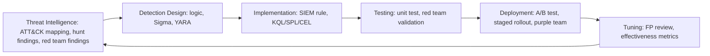
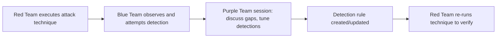
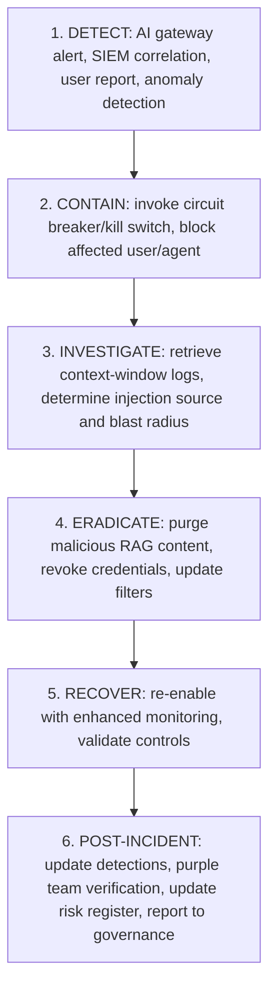

The SOC is undergoing its most significant transformation since SIEM was introduced. AI is simultaneously the biggest threat vector and the most powerful defensive tool available to defenders.

## SOC Evolution

Five generations mark the shift: SOC 1.0 (pre-2010, reactive perimeter-focused log monitoring and manual triage, overwhelmed by volume); SOC 2.0 (2010-2018, SIEM-centric correlation rules and basic playbooks, hit by alert fatigue and slow MTTR); SOC 3.0 (2018-2023, threat-intelligence-driven SOAR automation and hunting, limited by complex integrations and little ML use); SOC 4.0/AI-Assisted (2023-2026, LLM-assisted triage, alert summarization, natural-language hunting, GenAI investigation — still human-decision-dependent for most actions); and SOC 5.0/Autonomous (2026 onward, AI-native with autonomous triage and self-healing, limited by trust in AI decisions and novel attack evasion).

AI-assisted capabilities available now: LLM alert triage and prioritization (Microsoft Copilot for Security, Sentinel AI); natural-language threat hunting translating plain English into KQL/SPL (Copilot, Splunk AI, Chronicle YARA-L); incident summarization from raw telemetry (Cortex Copilot, CrowdStrike Charlotte AI); AI-driven malware analysis and explanation (CrowdStrike, Recorded Future AI); threat-actor profiling correlating indicators to known TTPs (Recorded Future, Mandiant Advantage); SOAR playbook generation from incident descriptions (Google SOAR, Palo Alto XSOAR); and vulnerability triage by exploitability and business context (Tenable ExposureAI, Qualys TruRisk AI).

## Detection Engineering

Detection engineering builds, tests, and maintains detection logic — the SOC's foundation.


*The detection engineering lifecycle runs continuously, feeding tuning insights back into threat intelligence.*

Sigma is the portable detection format compiling to any SIEM query language — a representative rule for AI gateway logs:

```yaml
title: AI Agent Prompt Injection Attempt
status: experimental
logsource:
    category: application
    product: ai-gateway
detection:
    selection:
        EventType: 'prompt_request'
    condition_injection:
        InputContent|contains:
            - 'ignore previous instructions'
            - 'disregard system prompt'
            - 'you are now DAN'
            - 'OVERRIDE:'
    condition: selection and condition_injection
falsepositives:
    - Security testing
    - Red team exercises
level: high
tags:
    - attack.execution
    - mitre-atlas.aml-t0051
```

Detection coverage should map to ATT&CK tactics with explicit targets: over 90% for Initial Access and Credential Access, over 85% for Execution and Privilege Escalation/Impact, over 80% for Persistence and Lateral Movement, over 75% for Defense Evasion and Exfiltration, over 70% for Collection. 2026 industry averages run well below these targets across every tactic (roughly 40-70%), and ATLAS-specific detection coverage is near-zero at most enterprises — a critical gap as AI adoption accelerates.

## Threat Hunting

Threat hunting is proactive, analyst-driven search for what automated detection misses, following the PEAK framework: Prepare (define a hypothesis from threat intel or an ATT&CK technique), Execute (hunt via queries over historical telemetry), Act (investigate findings and create a detection rule if the pattern is confirmed). A representative AI-specific hunt hypothesis: an insider is using the corporate AI assistant to exfiltrate documents by having it summarize and email content externally — executed by identifying AI sessions with unusually long output, correlating them with email-send events within 5 minutes, filtering for personal-domain recipients (gmail, outlook.com), and manually reviewing matches. LLMs accelerate hunting by translating hypotheses into SIEM queries, explaining results in plain English, suggesting further pivots, auto-correlating indicators to ATT&CK/ATLAS techniques, and generating hunt reports from evidence.

## Red Team, Blue Team, Purple Team

A traditional red team simulates an APT across the external perimeter (phishing, exploitation), internal network (lateral movement, privilege escalation), physical security (badge cloning, tailgating), and social engineering (vishing, pretexting) — the objective is testing whether the Blue Team can detect and respond, not merely whether the environment can be compromised.

AI red teaming applies the same adversarial discipline to AI systems specifically: jailbreak testing (systematic testing against 200+ known prompts), injection testing (malicious instructions across every input channel — PDFs, emails, URLs), extraction testing (membership inference, direct system-prompt requests), abuse testing (harmful content generation in controlled environments), agentic testing (redirecting agent goals, verifying kill-switch effectiveness), and integration testing (MCP server auth bypass, tool output poisoning) — run pre-deployment for every major model or prompt update, and quarterly on a continuous cadence otherwise.

The Blue Team operates SIEM/SOAR, responds to alerts, implements detection rules, hunts proactively, conducts forensics, and manages vulnerability remediation.


*Purple team exercises close the loop between attack simulation and detection tuning; the emerging AI-specific practice runs joint AI Red Team/SOC sessions to build detection rules for prompt injection and model abuse.*

## Continuous Validation

Breach and Attack Simulation (BAS) tools run daily automated tests across all ATT&CK tactics, with every SIEM detection rule carrying a corresponding BAS test, tracked via percent-detected and per-tactic MTTD, feeding findings directly into the detection engineering backlog — leading tools are Picus, SafeBreach, AttackIQ, and Cymulate. Cyber ranges provide isolated full-replica environments for safe incident-response practice, red team exercises, and detection-rule validation; AI-specific ranges add LLM deployments, RAG pipelines, and agent platforms for AI-focused training.

AI-specific continuous validation runs on its own cadence: a daily automated prompt-injection test battery (Garak, PromptBench), jailbreak regression testing per model update (red team automation), weekly RAG retrieval validation (adversarial documents inserted and monitored), continuous agent-behavior monitoring (anomaly detection on agent logs), continuous content-policy compliance sampling (output classifier), and monthly ATLAS technique-coverage review (manual red team plus checklist).

## Incident Response in the AI Era

AI incidents range from low to very-high complexity: AI abuse (a user exploiting AI for prohibited purposes — standard policy enforcement); prompt injection (attacker-manipulated AI via injected instructions — trace the source, update filters); data exfiltration via AI (sensitive data leaked through output — context-window forensics, breach assessment); an agent autonomous incident (unintended high-impact action — invoke the kill switch, assess blast radius, remediate); model compromise (tampered weights or training data — take the model offline, full forensic review); and AI supply-chain compromise (a compromised library or third-party model — replace the dependency, assess exposure).


*The AI incident response playbook mirrors the traditional IR lifecycle with AI-specific containment (kill switches) and investigation (context-window forensics) steps.*

## Security Operations KPIs

Mature-SOC targets: MTTD under 1 hour for critical incidents and under 24 hours for high; MTTR (contain) under 4 hours critical and under 24 hours high; false-positive rate under 10%; alert-to-ticket ratio under 20% (80% auto-resolved); detection coverage over 70% of ATT&CK techniques; BAS pass rate over 80%; at least 4 proactive hunt cycles per month; AI-incident MTTD under 4 hours (an evolving metric); and a SOC automation rate above 60% of incidents fully resolved without human intervention.

## Related

- [Cybersecurity Architect Part 3: Security Domains](03-security-domains.md)
- [Cybersecurity Architect Part 4: AI Security](04-ai-security.md)
- [Cybersecurity Architect Part 13: Security Patterns](13-security-patterns.md)
