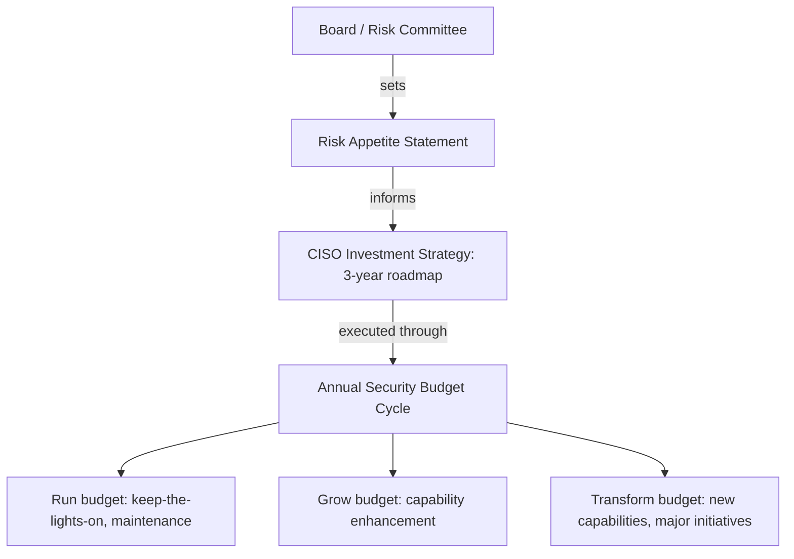

Security investment is a board-level discussion in most enterprises. This part provides the frameworks, models, and vocabulary needed to justify, prioritize, and govern security technology investment at executive level.

## Business Case Development

Security narratives fail when framed as pure cost centers. Successful framing casts security as risk reduction (quantified financial impact via the FAIR model), a business enabler (cloud adoption needs CSPM, AI adoption needs AI governance), regulatory compliance (non-compliance costs exceed investment cost), or competitive differentiation (SOC 2 Type II / ISO 27001 as a sales asset). A complete business case covers: an executive summary (problem, solution, ask, outcome in 2-3 sentences); the problem statement (risk position, capability gap, regulatory exposure); the proposed solution (capability and vendor rationale); the investment ask (Year-1/3-year/5-year, one-time versus recurring); expected benefits (quantified risk reduction, operational savings, compliance); risk-adjusted ROI (NPV, IRR, payback, sensitivity analysis); the risk of not investing (scenario probability × impact); an implementation plan (phased delivery, milestones, dependencies); and success metrics.

FAIR (Factor Analysis of Information Risk) quantifies cyber risk as a probability distribution of financial loss:

```
Risk = Threat Event Frequency × Loss Magnitude
Threat Event Frequency = Contact Frequency × Probability of Action
Loss Magnitude = Primary Loss (direct) + Secondary Loss (regulatory, reputational, response)
```

A worked ransomware example: a 0.3 events/year threat frequency with a 40% success probability (without the proposed control) against a $5M primary loss plus $2M secondary loss ($7M total) gives an Annual Loss Expectancy of 0.3 × 0.4 × $7M = **$840,000/year**. A proposed $200K/year EDR-plus-backup control reduces success probability to 10%, cutting residual ALE to 0.3 × 0.1 × $7M = **$210,000/year** — a **$630,000/year** risk-reduction value, a **215% Year-1 ROI**.

## Technology Roadmaps

A security technology roadmap communicates capability evolution across a 3-5 year horizon: the Now/2026 baseline (TOTP MFA, legacy SIEM, point EDR, manual patching, basic CSPM) progresses through Enhance at 12-18 months (FIDO2/passkeys, XDR, CNAPP, automated patching, DSPM), Optimize at 24-36 months (continuous auth, AI-assisted SOC, autonomous CSPM, AI vuln triage, AI governance), to Lead at 36-60 months (AI-driven IAM, autonomous SOC, self-healing systems, predictive risk, adaptive trust).

Roadmap development follows eight steps: baseline the current state against a reference capability model; define the target state per domain based on risk appetite, regulation, and strategy; run a gap analysis; prioritize investments by risk-reduction value, regulatory urgency, and strategic importance; sequence initiatives resolving dependencies into a phased plan; validate with CISO/CIO/finance/business stakeholders; secure ARB sign-off for major capabilities; and review quarterly against delivery milestones.

## Capability Mapping

A maturity heat map (1=Initial through 5=Optimizing) typically shows AI Security and Data Security as the largest gaps in 2026 — both often at maturity 1 against a target of 3, rated Critical/Very High priority — while Identity and Endpoint sit closer to target (maturity 3 toward 4, High priority) and Network Security trails least (3 toward 4, Medium priority). Value stream analysis then ties each business process to its supporting security capability and the value at risk: customer data processing (data encryption, DLP, DSPM — tens of millions in breach liability, Critical priority); AI-powered product delivery (AI security controls, prompt gateway — product liability and brand risk, Critical); cloud-hosted services (CSPM/CWPP/CNAPP — service disruption risk, Very High); employee productivity (identity, ZTNA, endpoint — ransomware risk, High); and software development (DevSecOps, SCA, secret scanning — supply-chain risk, High).

## Investment Prioritization

Score each candidate investment on four weighted dimensions — risk reduction value (40%, FAIR-based), regulatory/compliance urgency (30%, penalty exposure and audit findings), strategic enablement (20%, business capability unlocked), and operational efficiency (10%, cost or effort saved) — and rank by composite score to build a prioritized portfolio. Because standard ROI ignores the probabilistic nature of security benefits, risk-adjusted ROI uses expected value instead: `Risk-Adjusted ROI = (Expected Benefit − Investment Cost) / Investment Cost`, where `Expected Benefit = Σ(scenario probability × scenario financial impact) × control effectiveness`.

Platform consolidation economics illustrate portfolio rationalization: 45 point security tools running at $8.5M/year with very-high complexity and fragmented visibility consolidate to 10-15 tools at $5.5M/year with medium complexity and unified visibility — a $3M/year saving. Over-consolidation to a single vendor creates concentration risk; the recommended pattern is 2-3 strategic platform vendors plus best-of-breed fills for specialized needs.

## Financial Metrics

TCO spans licensing/subscription, implementation (professional services, engineering time), integration (API work, SIEM connectors), training, ongoing operations, maintenance, and exit costs (migration, termination, replacement) — AI security TCO adds GPU compute, LLM API costs, AI red-team labor, and model governance tooling. NPV discounts future cash flows to present value:

```
NPV = Σ(Cash Flow_t / (1 + discount_rate)^t) − Initial Investment
Cash Flow_t = Risk reduction value in year t − Annual operating cost in year t
discount_rate = WACC or hurdle rate, typically 8–12% for security investments
```

Invest when NPV > 0; higher NPV wins between alternatives. IRR is the discount rate at which NPV = 0 — invest when IRR exceeds the hurdle rate (unless the investment is strategically or regulatorily mandatory regardless); typical security-investment IRR runs 20-150% for high-priority risk reduction. Payback period is simple time-to-breakeven: accept 18-36 months for critical risk reduction, require under 18 months for pure operational efficiency, and up to 36-48 months for strategic enablement aligned to long-term strategy.

## Vendor Evaluation and Consolidation

Weight vendor evaluations across functional capability (30%, PoC and RFP scoring), integration depth (20%, native integrations to the existing stack), vendor viability (15%, financial health and roadmap), 3-year TCO (15%), the vendor's own security posture (10%, SOC 2 Type II, pen test results, breach history), and support quality (10%, SLA and references).

Build-versus-buy leans buy when the capability is non-differentiating, a vendor solution exists now, the problem is well-understood, the vendor can carry maintenance burden, TCO is comparable, and data-sharing with the vendor is acceptable; it leans build when the capability is a core competitive advantage, needs a custom solution, is novel, must stay internally owned, is significantly cheaper to build, or the data cannot leave the organization. For AI security tools specifically: buy prompt gateways, AI gateways, and DSPM; build only proprietary AI red-team automation and genuinely differentiated AI security controls.

## Security Debt and Legacy Modernization

Security debt is accumulated risk from deferred controls, legacy systems, and technical shortcuts. Common sources: unsupported OS/software (Windows Server 2012, Python 2.7), unpatched vulnerabilities over 90 days old, legacy authentication (passwords without MFA, NTLM), shadow IT, hardcoded credentials in source, missing encryption at rest, and AI tools adopted without governance. A representative debt inventory ranks by risk score and remediation cost: unpatched critical CVEs (9.2/10, ~$120K), legacy EOL OS (8.5/10, ~$200K), and hardcoded credentials (8.0/10, ~$80K) rate Critical priority; missing MFA (7.5/10, ~$50K), unencrypted storage buckets (7.0/10, ~$20K), and ungoverned AI tools (6.5/10, ~$150K) rate High priority.


*The technology investment decision architecture: board risk appetite flows down to a three-way annual budget split.*

Target allocation for a mature enterprise: Run 50-60% of the security budget, Grow 25-35%, Transform 10-20%. As AI security matures, Transform budget for AI capabilities should progressively shift into Grow and then Run — the normal progression from novel investment to standard operating expense.

## Related

- [Cybersecurity Architect Part 11: AI Investment](11-ai-investment.md)
- [Cybersecurity Architect Part 12: EA Deliverables](12-ea-deliverables.md)
- [Cybersecurity Architect Part 8: AI Governance](08-ai-governance.md)
