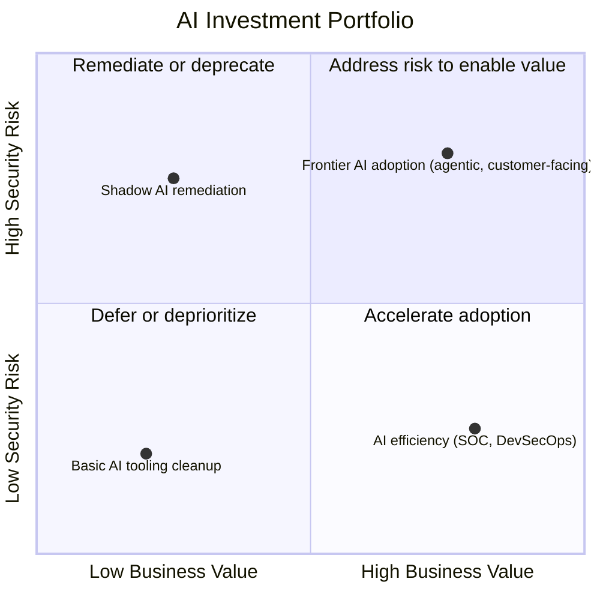

AI is simultaneously the most significant risk amplifier and the most powerful efficiency tool in the security portfolio. Investment decisions must account for both dimensions.

## Where AI Increases Cyber Risk

Understanding the risk side first prevents naive "AI will solve security" thinking. Every AI system — model endpoint, RAG store, agent — expands the attack surface, adding assets to secure and total security cost. Prompt injection operates at machine speed, so a single successful injection can trigger enterprise-wide data exfiltration. Attackers now use LLMs to generate novel malware, phishing, and social engineering, shortening attack cycles and making synthetic threats harder to detect. Deepfake voice and video enable CEO fraud and identity impersonation at scale, driving finance fraud and reputational damage. Shadow AI — employees using unapproved tools on sensitive data — leaks data to third-party providers and creates compliance violations. A compromised open-source model or AI library in the supply chain can backdoor deployed AI and steal credentials. Agents taking irreversible actions without oversight create financial and legal liability. And non-compliance with the EU AI Act or ISO 42001 carries fines up to 3% of global turnover.

## Where AI Reduces Security Cost

The ROI case runs the other direction just as strongly. LLM alert triage cuts analyst reading time 60-70%, worth $300K-$800K/year (2-3 analyst FTEs); SOAR-plus-LLM auto-resolution of tier-1 incidents saves $200K-$500K/year and speeds MTTR; AI vulnerability prioritization by exploitability and business context cuts patch effort ~40%; natural-language-to-SIEM-query hunting runs roughly 5x faster, worth $150K-$300K/year; AI-automated compliance evidence collection saves $100K-$400K/year of GRC labor; LLM-drafted security policy saves $50K-$150K/year; AI-assisted SAST/code review in the PR pipeline cuts security findings reaching production ~30%; and AI-personalized security awareness training raises completion rates and measurable behavior change. For a roughly 5,000-employee enterprise, the total addressable efficiency opportunity from AI augmentation runs **$1M-$3M/year**.

## Security Automation ROI Framework

Automation suitability varies by task: alert triage, vulnerability scanning, compliance evidence assembly, phishing analysis, and incident summarization are all High suitability (repetitive, pattern-based, or format-driven — LLM classification and summarization apply directly); forensic investigation and threat hunting are Medium (AI accelerates, but a human must direct and judge); penetration testing, strategic risk advisory, and board risk communication are Low (creative, contextual, or relationship-driven — AI drafts, a human leads).

```
AI Security Tool ROI = (Hours saved × Analyst hourly cost + Risk reduction value − Tool cost) / Tool cost

Example: AI alert triage tool
  Hours saved: 1,200/year × $75/hour = $90,000 labor value saved
  Risk reduction (faster MTTR → fewer breaches): $120,000/year (probabilistic)
  Tool cost: $80,000/year
  ROI = ($90,000 + $120,000 − $80,000) / $80,000 = 163%
```

## Investment Trade-Off Frameworks

**Build versus buy** for AI security: buy (or use cloud-native) the AI prompt gateway (Kong AI Gateway, Azure APIM, AWS API Gateway), AI content safety (Azure AI Content Safety, AWS Guardrails), agent identity (SPIFFE/SPIRE — CNCF-maintained, don't rebuild identity protocols), and secrets management (HashiCorp Vault); buy-and-customize AI red-team tooling (Garak plus custom test cases) and model risk monitoring (Arize AI, Fiddler, extended with custom metrics); build custom AI governance policies, AI SOC automation playbooks, and AI threat detection rules, since these are inherently specific to your risk appetite and environment.

Open-source models give full data control and compliance ownership at the cost of owning updates and security patches yourself, and suit sensitive data, cost-at-scale, or customization needs; managed AI APIs (Claude, GPT-4o, Gemini) give frontier capability with minimal engineering but limited data control and a required vendor BAA/DPA, and suit general enterprise AI needing fastest time-to-value. Recommendation: start with managed APIs for PoC and non-sensitive use cases, migrate to private/open-source deployment where regulated data, high-volume cost reduction, or data sovereignty requires it.

Cloud AI carries no capital cost but can run expensive per-use pricing at scale, with data sovereignty depending on region and terms; on-premises AI requires high capital cost (GPU hardware, data center) and 3-12 months to value, but gives complete data sovereignty and full security responsibility — reserved for air-gapped, defense, or very-high-volume needs. A single-model approach (e.g., Claude-only) is simpler to govern but risks vendor lock-in and a single point of failure; multi-model gives best-of-breed capability and resilience at the cost of routing and governance complexity — the recommended pattern is multi-model behind an AI gateway that abstracts model specifics and enables switching without application changes.

An AI gateway centralizes security controls, cost tracking, audit logging, and prompt-injection defense that direct model access leaves fragmented per application — always use a gateway for enterprise AI; direct access is acceptable only for isolated development or experimentation. A centralized AI platform gives strong governance, consistent security, and lower total infrastructure cost at the price of slower adoption, versus federated team ownership which adopts faster but risks inconsistent governance and duplicated infrastructure — the recommended pattern is a centralized platform with self-service access, where the central team owns security controls and shared infrastructure while teams build on top without standing up custom infrastructure.

## Cost-Benefit Framework for Executive Decisions

Every major AI or AI-security investment should answer five questions: what risk does this address or introduce (quantified via FAIR, with P10/P50/P90 outcomes)? What is the cost of inaction at 12 and 24 months? What are the alternatives (at least two — build/buy, vendor A/B, full-scope/MVP)? What does success look like, measurably (3-5 KPIs)? What is the implementation risk — technical, organizational, and regulatory?


*Plotting AI investments on business value against security risk drives priority: high-value/high-risk items get risk addressed to unlock value; high-value/low-risk items get accelerated; low-value/high-risk items get remediated or killed; low-value/low-risk items get deferred.*

AI security budget as a share of total AI budget declines with maturity: an early AI adopter should spend 25-30% (establishing baseline security), a growing-usage organization 15-20% (security scales sub-linearly with capability investment), and a mature AI organization 10-15% (controls are established and security is operational, not project-based). 2026 industry benchmarks: financial services 20-25% of AI budget on AI security, healthcare 18-22%, retail/e-commerce 12-15%, technology companies 10-18%.

## Related

- [Cybersecurity Architect Part 10: Technology Investment](10-technology-investment.md)
- [Cybersecurity Architect Part 8: AI Governance](08-ai-governance.md)
- [Cybersecurity Architect Part 12: EA Deliverables](12-ea-deliverables.md)
