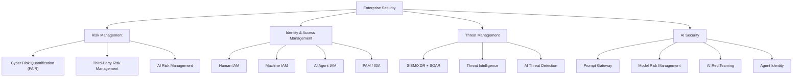
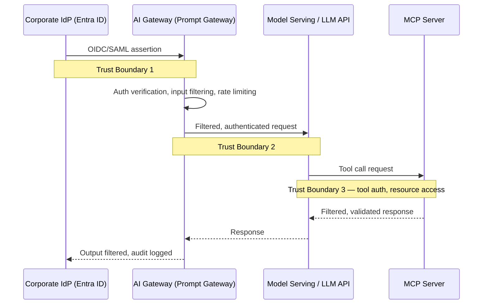

This part shows how security integrates into every major enterprise architecture artifact — from principles to roadmaps — using templates and examples from the AI era.

## Security Principles

Security principles are foundational, technology-agnostic rules agreed at executive level that rarely change. A representative set: Least Privilege (limiting access scope reduces blast radius — every human, machine, and agent identity scoped to minimum necessary access); Assume Breach (perimeter controls alone can't guarantee a secure interior — defense-in-depth, microsegmentation, rapid detection); Security by Design (retrofitting costs ~10x more than designing in — requirements captured at inception, threat model before build); Data is the Ultimate Asset (protecting data directly is more resilient than protecting infrastructure — encryption-first, mandatory classification, DLP on all sensitive flows); Identity is the Control Plane (network location no longer determines trust — Zero Trust, FIDO2, continuous verification); AI Systems are Untrusted by Default (AI outputs are probabilistic and manipulable — treated as untrusted input, validated before action, human oversight); Transparency and Auditability (security decisions must be explainable — comprehensive logging, tamper-evident trails, explainable AI); and Shared Responsibility is Active, Not Passive (cloud/vendor SLAs don't transfer responsibility — explicit control assignment per shared service, vendor assurance program).

## Security Architecture Vision

A 1-2 page document articulating direction and rationale, structured as: Where We Are Today (current posture, key gaps, forcing functions like AI adoption or regulation); Where We Need to Be — a 3-year target (e.g., "a Zero Trust posture with AI-native security operations, full data classification coverage, and ISO 42001-certified AI governance, enabling confident agentic AI adoption"); The Journey (Foundation → Enhancement → Optimization phases); What This Enables (business outcomes); and What This Costs (a directional investment envelope, not a detailed budget).

## Target and Baseline Architecture

The baseline architecture document captures current state: an inventory of security tools and platforms, network diagrams with trust zones marked, identity architecture (IdP, MFA coverage, privilege model), sensitive-data flows, and known vulnerabilities and control gaps. The target architecture document defines the desired end state across domains — for example, a 2028 target might specify 100% FIDO2 with Entra Agent ID for every AI agent and SPIFFE for every service workload (Identity); full SASE with microsegmentation across all production environments (Network); DSPM covering all cloud data stores with 100% classification and DLP on every AI interaction (Data); a prompt gateway for all AI access, quarterly AI red teaming, and ISO 42001 certification (AI Security); an AI-assisted SOC with over 60% autonomous tier-1 resolution and sub-1-hour MTTD for critical threats (Operations); and continuous compliance with automated evidence collection, EU AI Act-compliant for all high-risk AI (GRC).

## Security Capability Map


*A four-domain security capability map: Risk Management, IAM, Threat Management, and AI Security, each decomposed to Level 2 capabilities.*

## Architecture Decision Records

ADRs capture significant decisions with context and rationale, preventing the same debate from recurring. A representative ADR:

```markdown
# ADR-SEC-042: AI Agent Identity Standard
**Status:** Accepted | **Deciders:** CISO, EA Lead, CTO

## Context
Deploying AI agents across three business units; agents need identities to
authenticate to MCP servers, databases, and external APIs. Evaluated:
(a) OAuth client credentials, (b) SPIFFE/SPIRE, (c) cloud managed identity.

## Decision
Azure managed identity as primary agent identity for Azure-deployed agents.
SPIFFE/SPIRE for multi-cloud and on-prem agents. OAuth client credentials
as fallback for external APIs without managed-identity support.

## Rationale
Managed identity eliminates credential storage entirely for Azure-native
agents; SPIFFE gives equivalent capability elsewhere. OAuth client
credentials introduce rotation overhead and secret-storage risk.

## Consequences
+ No credential storage for 90%+ of agents; automatic token rotation
- Requires agents to run in Azure compute or SPIRE-enrolled environments
- Third-party APIs requiring client-secret auth need separate handling
```

Every enterprise should maintain ADRs for: AI agent identity standard, AI gateway platform selection, Zero Trust network architecture approach, secrets management platform, CNAPP selection, SIEM/XDR platform, MFA standard (FIDO2 vs. TOTP), data classification framework, AI governance oversight tiers, and model deployment approach (managed vs. self-hosted).

## Trust Boundary Diagrams


*Every hop between trust zones — identity provider, gateway, model, and MCP server — is an explicit, independently-controlled trust boundary.*

## Threat Models

STRIDE applied to AI systems: Spoofing (an attacker impersonates an agent to invoke MCP tools — controlled via agent authentication, managed identity, mTLS); Tampering (training data poisoned to alter model behavior — data lineage, integrity checks, validation); Repudiation (an agent acts with no audit trail — immutable per-action audit logging); Information Disclosure (system prompt leaked to a user — gateway filtering, explicit non-disclosure instructions); Denial of Service (the model endpoint overwhelmed by prompt flooding — rate limiting, cost controls, circuit breakers); Elevation of Privilege (an agent manipulated to access resources beyond its scope — least-privilege scoping, task-level tokens).

## Zero Trust Reference Architecture

CISA's model spans seven pillars: Identity (verify every user/entity — FIDO2, continuous auth, UEBA); Device (verify health before access — MDM, compliance checks, conditional access); Network (segment and encrypt — ZTNA, microsegmentation, mTLS); Application (least-privilege access — PAM, CASB, API gateway, WAF); Data (classify and protect by sensitivity — DSPM, DLP, encryption); Visibility & Analytics (monitor for anomalies — SIEM, XDR, UEBA); and Automation & Orchestration (automate response — SOAR, CNAPP remediation, AI-assisted).

The traditional seven pillars don't account for AI agents, requiring two extensions: Pillar 8, AI Identity — every agent must carry a verifiable identity (managed identity, SPIFFE, or IETF AIMS); agents are never trusted merely because they run on trusted infrastructure. Pillar 9, Intent Verification — for high-risk actions, verify the agent's intended action matches the authorizing human's actual intent, not just that the agent is authenticated, via HITL approval gates and intent-aware authorization policies.

## Security Roadmaps

A phased template: Phase 1 Foundation (0-6 months) deploys FIDO2 MFA for privileged users, an AI gateway for all enterprise AI access, CSPM across all cloud environments, a full AI system inventory, and a published AI security/acceptable-use policy. Phase 2 Enhancement (6-18 months) rolls out SPIFFE/managed identity for all agents (eliminating API keys), DSPM across all cloud data stores, a quarterly AI red team program, a CNAPP platform replacing point tools, and an ISO 42001 gap assessment. Phase 3 Optimization (18-36 months) delivers an AI-assisted SOC (over 60% automated tier-1 triage), continuous compliance monitoring, ISO 42001 certification, confidential computing for regulated AI workloads, and a post-quantum cryptography migration plan.

A representative investment roadmap maps initiatives to phases with cost and priority: Phase 1's AI Gateway (~$200K), FIDO2 rollout (~$150K), and CSPM (~$350K/yr) all rate Critical priority with High-to-Very-High risk reduction; Phase 2's CNAPP platform (~$800K/yr), agent identity/SPIFFE (~$200K), and AI red team capability (~$300K) rate High priority; Phase 3's AI-assisted SOC (~$500K/yr), ISO 42001 certification (~$150K), and PQC migration planning (~$100K) rate Medium priority, reflecting risk-reduction value declining as foundational controls mature.

## Related

- [Cybersecurity Architect Part 13: Security Patterns](13-security-patterns.md)
- [Cybersecurity Architect Part 10: Technology Investment](10-technology-investment.md)
- [Cybersecurity Architect Part 2: Enterprise Security Architecture](02-enterprise-security-architecture.md)
