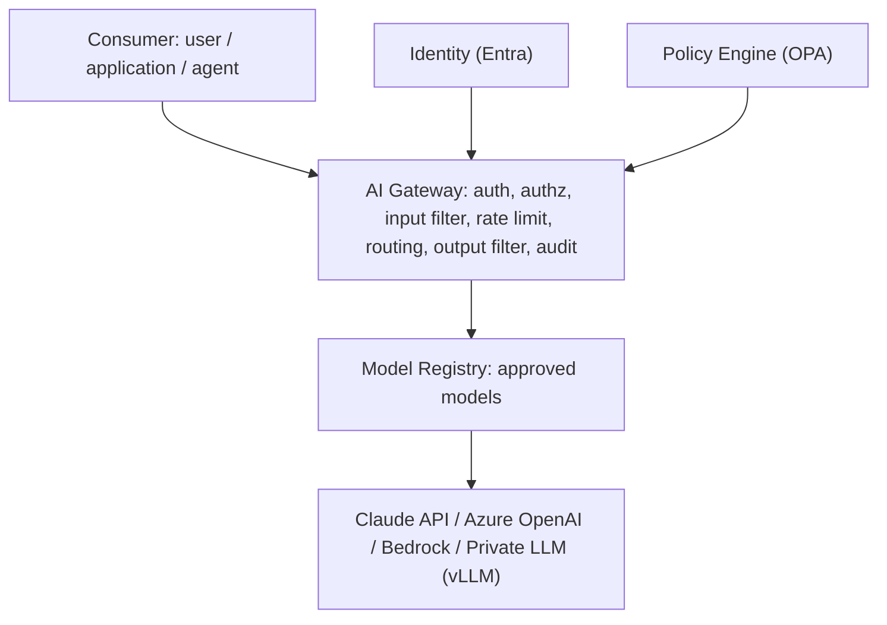
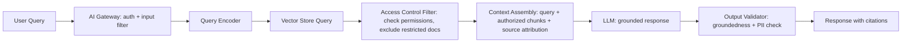
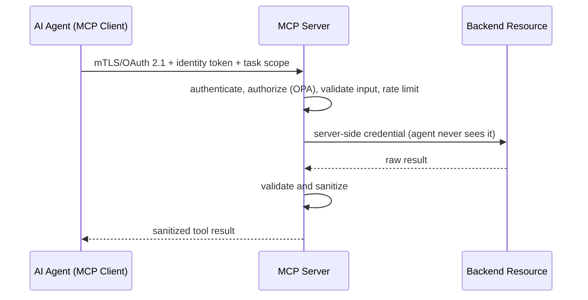
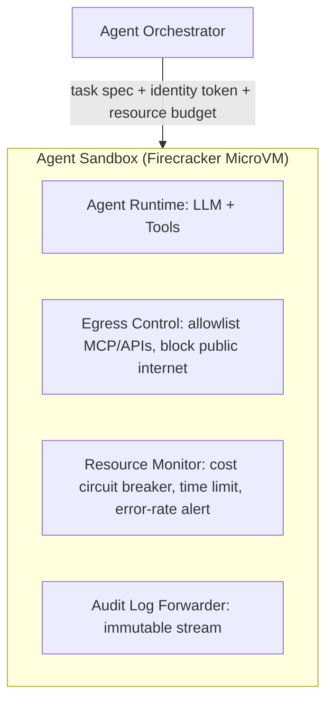
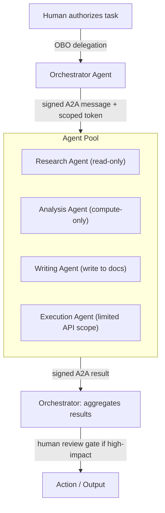
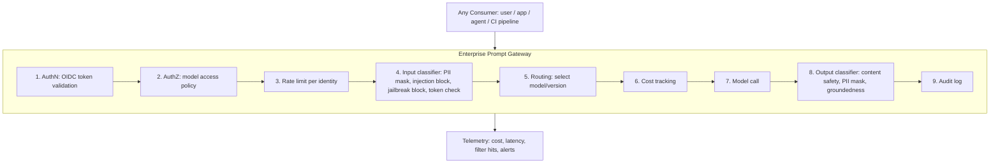
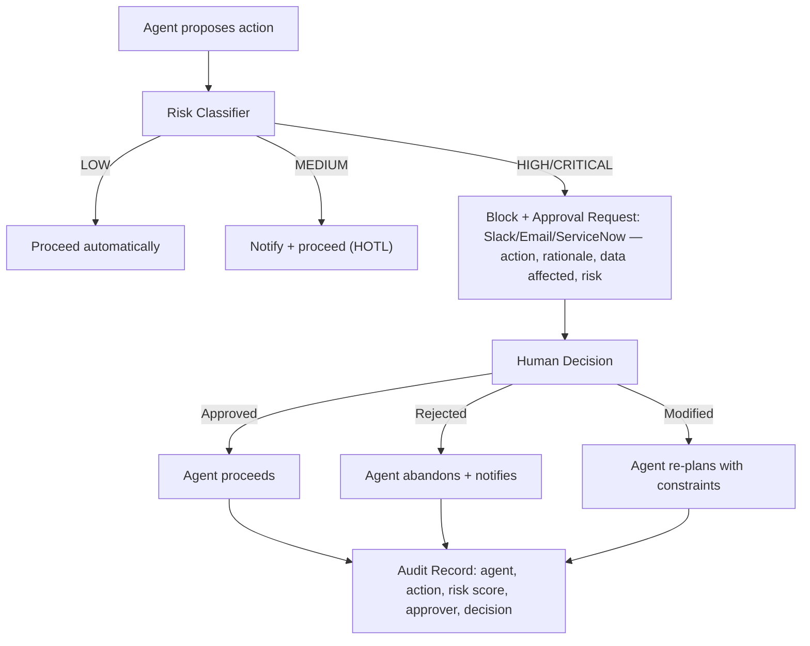
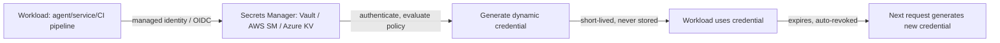
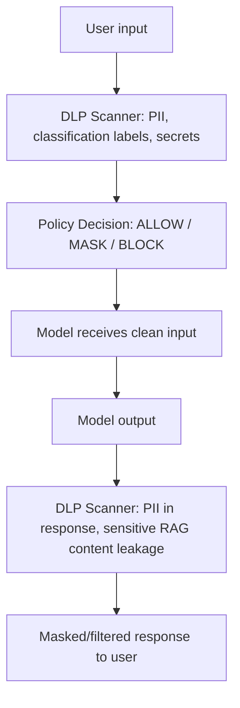

Reusable security patterns for the AI era — each with an architecture diagram, key controls, and when to use it.

## Secure AI Platform Pattern

A centralized enterprise AI platform providing secure, governed access to AI capabilities for all internal consumers.

*Every consumer path runs through a single governed gateway before reaching any approved model.*

Key controls: OIDC/Entra authentication identifying every consumer; OPA-policy authorization scoping model access by group and use case; input filtering for PII, injection patterns, and prompt length; output filtering for content safety, PII masking, and groundedness; per-user/per-app rate limiting with cost-based circuit breakers; full audit logging (user, model, token count, filtered content); and model governance restricting access to ARB-approved models only.

## Secure RAG Pattern

Retrieval-Augmented Generation with document-level access control, preventing retrieval of documents a user isn't authorized to see.

*Access control is enforced at retrieval time, before restricted content ever reaches the model's context.*

Key controls: document-level ACLs tagged on each vector chunk and filtered at retrieval; mandatory source-attribution citations for provenance audit; chunk isolation so users can't infer restricted content from responses; authenticated access to non-public embedding models; ingestion restricted to authorized services; and an output validator flagging ungrounded responses.

## Secure MCP Server Pattern

An MCP server giving agents authorized tool access without ever exposing backend credentials to them.

*The agent never holds a backend credential — the MCP server is the sole credential-bearing party.*

Key controls: agent authentication via SPIFFE SVID mTLS or OAuth 2.1 bearer token; per-tool ACLs with explicit grants; server-side credential isolation; JSON Schema parameter validation; response sanitization (PII masked, sensitive fields redacted); a full audit trail (agent, tool, parameters, response hash); per-agent per-tool rate limiting; and tool-schema hash pinning to detect tampering.

## Secure Agent Runtime Pattern

A sandboxed execution environment limiting blast radius, enforcing egress control, and giving complete audit visibility.

*MicroVM isolation, egress allowlisting, and resource budgets bound what a single agent can do even if fully compromised.*

Key controls: full kernel isolation via MicroVM (no host escape); network egress allowlisting to permitted MCP/API endpoints only; read-only filesystem except a scratch space, no host filesystem access; hard resource budgets on time, tokens, and cost; circuit breakers auto-terminating on anomalous behavior; and an immutable, append-only audit log stream.

## Secure Multi-Agent Architecture Pattern

Orchestration where inter-agent trust is explicit, message integrity is enforced, and one agent's compromise has bounded blast radius.

*Each agent's capability is partitioned — a compromised read-only agent structurally cannot write.*

Key controls: signed inter-agent messages verified by the receiver; scoped per-task per-agent delegation tokens, always a sub-scope of the orchestrator's own authority; independent authorization per agent at the resource server (no inherited trust); capability-based blast-radius isolation; a human review gate before high-impact aggregated actions execute; and a correlation-ID audit trail across the full conversation.

## Enterprise Prompt Gateway Pattern

A security-as-infrastructure layer enforcing consistent controls across every enterprise AI interaction.

*A ten-stage pipeline that every prompt traverses, regardless of consumer type.*

Implementation options trade integration depth against flexibility: Azure API Management with AI extensions (cloud-native, best for Azure-only, deep Entra integration); Kong AI Gateway (multi-cloud, plugin ecosystem, self-hosted or SaaS); LiteLLM plus custom filters (open source, flexible, requires engineering to add controls); and Portkey or Helicone (purpose-built SaaS gateways, less customizable).

## Human-in-the-Loop Pattern

An approval workflow pausing agent execution before irreversible or high-impact actions.

*Risk classification determines the oversight tier, from fully autonomous to senior human approval.*

Representative risk classification: reading a document or searching the web is LOW/autonomous; an internal Slack message or calendar event is MEDIUM/HOTL (notify); sending external email, deleting a file, or a database write is HIGH/HITL (approve); transferring funds or modifying production infrastructure is CRITICAL/HOOL (senior approval).

## Secrets Management Pattern

Centralized secrets management providing dynamic, short-lived credentials, eliminating long-lived secrets from code, configs, and containers.

*No credential outlives a single request — theft has a near-zero abuse window.*

Key controls: dynamic, never-reused secrets generated per request; automatic revocation tied to the calling workload's lifecycle; policy-based access restricting which workloads can request which secret types; a full audit trail of every secret request; and a break-glass procedure for emergency access with enhanced logging and dual approval.

## AI Observability Pattern

Comprehensive observability spanning requests, cost, latency, content quality, safety events, and agent behavior. Representative metrics and alert thresholds: p99 latency alerting above 5 seconds; cost alerting above $500/hour; a RAG groundedness score below 0.7 triggering review; content filter hits above 20/hour triggering investigation; injection detections above 5/hour triggering a SIEM alert; anomalous per-session agent actions or cost-per-task triggering a circuit breaker; and model API error rate above 5% triggering failover.

## Secure Vector Database Pattern

Key controls: per-tenant namespace isolation with separate encryption keys; authenticated, per-namespace query authorization; ingestion-time scanning for malicious content before embedding; AES-256 encryption at rest with customer-managed keys; per-query audit logging (requestor identity, returned chunk IDs); quarterly-tested backup and recovery; and PII detection excluding sensitive content before ingestion.

## Data Loss Prevention for AI Pattern

*DLP scans both the inbound prompt and the outbound response — a model can leak sensitive data it was never directly given, via RAG context or hallucination.*

Representative policies: blocking any input containing a 16-digit card pattern with a user alert; masking SSN patterns detected in output; blocking and alerting the CISO on any input labeled SECRET; allowing PHI input only when a BAA is in place (logged regardless); and blocking all calls to external models entirely under a private-AI-only policy.

## Related

- [Cybersecurity Architect Part 5: Agentic AI Security](05-agentic-ai-security.md)
- [Cybersecurity Architect Part 12: Enterprise Architecture Deliverables](12-ea-deliverables.md)
- [Cybersecurity Architect Part 2: Enterprise Security Architecture](02-enterprise-security-architecture.md)
