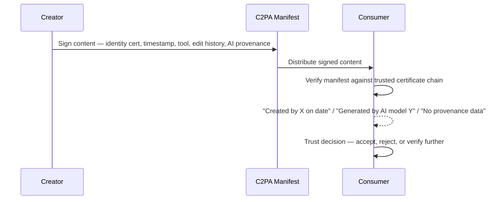

**Standard:** NIST AI 100-4 (May 2024 draft, final 2024) — *Reducing Risks Posed by Synthetic Content*. **Audience:** CISO, digital forensics, communications security, content security.

## Introduction

NIST AI 100-4 addresses AI-generated synthetic content — text, images, audio, video — across detection (identifying AI-generated content), provenance (attributing content to its source), authentication (verifying content hasn't been tampered with), and watermarking (technical standards for embedding origin signals).

Synthetic content is a security problem across several attack classes: social engineering (a deepfake CEO voice authorizing a wire transfer, a deepfake executive video announcing market-moving news, AI-generated spear-phishing at scale, AI-generated fake IDs/contracts/compliance reports); disinformation (fake news with realistic images, fabricated threat intelligence reports, synthetic security-researcher identities, fake vulnerability advisories); enterprise security incidents (a deepfake defeating identity verification on a video call, malicious code hidden in benign-looking AI output, synthetic incident reports misleading IR teams, fake compliance evidence); and scale amplification (one attacker sending 10,000 personalized phishing emails instead of one, with the barrier to entry near zero via ChatGPT, MidJourney, and ElevenLabs).

## Taxonomy of Synthetic Content

Content types and their primary attack use: synthetic text via LLM generation (phishing, disinformation, fake reports); synthetic images via diffusion models — DALL-E, Midjourney, Stable Diffusion (fake IDs, visual social engineering); synthetic audio via voice cloning — ElevenLabs and similar (vishing, voice-based BEC); synthetic video/deepfakes via face-swap or full generation (high-value fraud, executive impersonation); synthetic biometrics via generative models (identity verification bypass); and hybrid content, a real base with AI modification (video/audio manipulation).

AI 100-4 distinguishes synthesis (entirely AI-generated content, e.g. a phishing email's text, detected via AI classifiers) from manipulation (real content with AI modifications, e.g. a real CEO video with an AI-altered voice, or a real document with AI-altered numbers, detected via forensic artifact analysis and provenance verification) — manipulation is often harder to detect than pure synthesis because its statistical distribution stays close to authentic content.

## Detection Approaches

AI text detection uses an ensemble of methods since no single detector is reliable: perplexity analysis (LLM-generated text is characteristically low-perplexity, measured against a reference model like GPT-2), a trained classifier, burstiness/distribution analysis (human text has more sentence-complexity variance), and watermark detection where applicable.

```python
class AITextDetector:
    """Multi-method AI text detection per NIST AI 100-4."""

    def detect(self, text: str) -> dict:
        results = {
            "perplexity": self._perplexity_analysis(text),
            "classifier": self._classifier_predict(text),
            "burstiness": self._burstiness_analysis(text),
            "watermark": self._check_for_watermark(text),
        }
        confidence_scores = [r.get("ai_probability", 0) for r in results.values()
                           if isinstance(r, dict)]
        ensemble_score = sum(confidence_scores) / len(confidence_scores)
        return {
            "ai_probability": ensemble_score,
            "verdict": "AI_GENERATED" if ensemble_score > 0.7 else "LIKELY_HUMAN",
            "confidence": abs(ensemble_score - 0.5) * 2,
            "method_results": results,
            "caveat": "AI detection is imperfect. False positive rate is non-trivial."
        }

    def _perplexity_analysis(self, text: str) -> dict:
        """Low perplexity (<30) against a GPT-2 oracle suggests AI generation."""
        import torch
        from transformers import GPT2LMHeadModel, GPT2Tokenizer
        model = GPT2LMHeadModel.from_pretrained('gpt2')
        tokenizer = GPT2Tokenizer.from_pretrained('gpt2')
        encodings = tokenizer(text, return_tensors='pt')
        with torch.no_grad():
            outputs = model(**encodings, labels=encodings['input_ids'])
            perplexity = torch.exp(outputs.loss).item()
        return {"perplexity": perplexity, "ai_probability": max(0, 1 - (perplexity / 100))}
```

Deepfake video/image detection uses multi-modal artifact analysis: spatial artifacts (face-boundary blurring, inconsistent lighting, blink-frequency anomalies, hair/ear rendering issues); temporal inconsistencies across frames; physiological signal analysis via remote photoplethysmography (real faces show a subtle heartbeat-driven color signal at 60-100 BPM that deepfakes often lack); audio-visual sync issues; and compression-artifact analysis (deepfakes are often re-compressed).

```python
class DeepfakeDetector:
    """Video/image deepfake detection via multi-modal artifact analysis."""

    def analyze_video(self, video_path: str) -> dict:
        results = {
            "spatial": self._detect_spatial_artifacts(video_path),
            "temporal": self._detect_temporal_inconsistencies(video_path),
            "physiological": self._detect_rppg_inconsistencies(video_path),
            "av_sync": self._detect_av_sync_issues(video_path),
            "compression": self._analyze_compression_artifacts(video_path),
        }
        return self._ensemble_decision(results)

    def _detect_rppg_inconsistencies(self, video_path: str) -> dict:
        """Real faces show periodic ~60-100 BPM rPPG signal; deepfakes are noisy/absent."""
        rppg_signal = self._extract_rppg_signal(video_path)
        signal_quality = self._analyze_signal_periodicity(rppg_signal)
        return {"rppg_quality": signal_quality, "deepfake_indicator": signal_quality < 0.3}
```

NIST AI 100-4's key finding: detection alone is insufficient. Text detectors carry 5-15% false positive rates on human text and 20-40% false negatives on lightly-edited AI text, degrade rapidly outside their training-set models, and are defeated by paraphrasing tools — unsuitable as a sole decision tool. Image deepfake detectors run 85-95% accurate against current-generation fakes but drop to 40-60% against adversarially-attacked deepfakes, with poor cross-database generalization. Video deepfake detectors hit 90-97% on benchmarks but only 70-80% in the real world (compression, format changes), and around 50% against adversarial deepfakes. Modern voice clones (ElevenLabs, OpenVoice) are extremely difficult to detect technically — the recommendation is out-of-band verification, not detection.

## Provenance and Authentication (C2PA)

The Coalition for Content Provenance and Authenticity (C2PA) is the technical standard NIST AI 100-4 endorses for content provenance, adopted by Adobe, Microsoft, Google, Sony, Canon, and the BBC among others.


*C2PA workflow: a Claim asserts origin/history, a Manifest bundles claims with signatures, a Hard Binding cryptographically links the manifest to content, and a Soft Binding (watermark) survives content transformations.*

A representative enterprise C2PA implementation signs AI-generated content with a manifest recording the AI model/provider, generation timestamp, and (deliberately) no prompt disclosure for privacy, plus an optional human-review assertion when a person approved the content:

```python
class C2PAContentProvenanceService:
    """Enterprise C2PA implementation for AI-generated content provenance."""

    def sign_ai_generated_content(self, content_path, ai_model, ai_provider,
                                   human_approved, approver_identity=None) -> str:
        manifest_def = {
            "claim_generator": "Enterprise-AI-Content-Service/1.0",
            "assertions": [
                {"label": "c2pa.ai.training",
                 "data": {"entries": {f"com.{ai_provider}.{ai_model}": {"use": "notUsed"}}}},
                {"label": "c2pa.ai.generative",
                 "data": {"prompt": "NOT_DISCLOSED", "model": ai_model, "provider": ai_provider,
                          "generation_date": datetime.utcnow().isoformat()}},
            ]
        }
        if human_approved and approver_identity:
            manifest_def["assertions"].append({
                "label": "c2pa.editorial.review",
                "data": {"reviewer": approver_identity, "approved": human_approved}
            })
        # Sign with enterprise certificate; see opensource.contentauthenticity.org
        return content_path.replace(".", "_signed.")

    def verify_content_provenance(self, content_path: str) -> dict:
        try:
            reader = c2pa.Reader.from_file(content_path)
            manifest_store = reader.get_active_manifest()
            if not manifest_store:
                return {"has_provenance": False, "verdict": "NO_PROVENANCE",
                        "recommendation": "Treat as unverified — could be AI-generated"}
            assertions = manifest_store.get("assertions", [])
            ai_assertions = [a for a in assertions if "ai" in a.get("label", "")]
            return {
                "has_provenance": True,
                "ai_generated": len(ai_assertions) > 0,
                "trust_level": "VERIFIED" if manifest_store.get("validation_status") == "valid" else "UNVERIFIED",
                "recommendation": "AI-generated — verify with human" if ai_assertions else "Appears authentic"
            }
        except c2pa.Error as e:
            return {"has_provenance": False, "error": str(e), "verdict": "VERIFICATION_FAILED"}
```

Watermarking approaches per NIST AI 100-4: visible watermarks (simple overlays, easily cropped, useful only where removal itself is detectable); invisible/robust watermarks (statistical signal in noise patterns, e.g. Google SynthID for Gemini images/audio, though they may not survive heavy compression); cryptographic watermarks (a hash of generation parameters embedded and recomputed for verification, tamper-evident, suited to legal evidence and compliance); and text watermarks (a green/red token-list bias during generation, detected statistically, but defeated by paraphrasing — still an active research area with no production-ready standard). Enterprise recommendation: implement C2PA manifest signing for all AI-generated enterprise content, use SynthID or equivalent where available for image generation, never rely on watermarking alone in adversarial contexts, and combine with out-of-band verification for high-stakes content.

## Security Operations: Synthetic Content Playbooks

**PB-SC-01, Deepfake Executive Voice/Video**: indicators include a wire-transfer or sensitive-action request via video call, an unusual financial/security request by voice, or a badge request based on video verification alone. Immediate actions: pause the request rather than act under time pressure, verify via a known-good out-of-band channel, and escalate to the CISO above a defined dollar threshold. Technical analysis: run a deepfake detector on the recording, analyze audio for synthetic artifacts, and check C2PA provenance if the content was digital. Never trust real-time video as sole authentication for high-risk actions, and never treat an AI detector verdict as final without human judgment.

**PB-SC-02, AI-Generated Phishing at Scale**: indicators include a sudden spike in unusually personalized phishing reports, phishing that passes standard grammar checks, or content referencing specific internal projects or personnel. Immediate actions: quarantine the campaign, run AI text detection on a sample set, and alert affected users. Investigation: determine how the attacker obtained personalization data (OSINT or breach), check whether internal data was used (possible insider or prior breach), and share IOCs with email security vendors.

**PB-SC-03, AI-Generated Threat Intelligence Reports**: the risk is an attacker fabricating TI reports to mislead the SOC. Indicators: a report from an unusual source with no verification chain, an implausible alleged threat actor, or a failed/absent C2PA provenance check. Actions: verify the source against known-good TI feeds, cross-reference claims across independent sources, check the author's identity and publication history, and never act on single-source unverified TI for major decisions.

## Regulated Industry Applications

Financial services faces deepfake CFO transaction authorization, AI-generated contract disputes, synthetic voice defeating phone-banking authentication, fake compliance evidence, and deepfake KYC/AML bypass — controlled via liveness detection with anti-spoofing on video KYC, MFA that doesn't rely on biometrics alone, out-of-band transaction authorization (SMS/hardware token), C2PA provenance on all contract execution, and behavioral biometrics supplementing deepfake-vulnerable ones. Healthcare faces AI-generated fake medical imaging, synthetic patient records for insurance fraud, deepfake physician prescription authorization, and fabricated research data — controlled via C2PA provenance on clinical imaging, AI-image detection in the radiology workflow, out-of-band verification for high-risk prescriptions, and digital signature requirements for research data. Government and election integrity face deepfake political videos, AI-generated disinformation at scale, synthetic legal evidence, and impersonated official communications — controlled via CISA synthetic media guidance, cryptographic signing of official communications, publicly C2PA-signed official media, and voter education.

## Enterprise Implementation Roadmap

| Phase | Timeline | Key Actions |
|-------|----------|-------------|
| Assess | Month 1 | Inventory AI content generation uses; identify highest-risk scenarios |
| Policy | Month 2 | Acceptable use policy for AI-generated content; disclosure requirements |
| Detect | Month 3 | Deploy AI text detector in the email gateway; train the phishing team on synthetic indicators |
| Provenance | Months 4-6 | Implement C2PA signing for enterprise-published AI content |
| Response | Month 6 | Activate synthetic content playbooks (PB-SC-01, 02, 03) |
| Training | Ongoing | Annual synthetic content awareness training for executives (BEC/deepfake risk) |

## Related

- [NIST AI Standards Part 1: NIST AI 100-2 Adversarial ML](01-part-01-nist-ai-100-2-adversarial-ml.md)
- [NIST AI Standards Part 3: CAISI Agentic AI Security](03-part-03-caisi-agentic-ai.md)
- [NIST AI Standards Part 6: Implementation Checklist](06-part-06-implementation-checklist.md)
