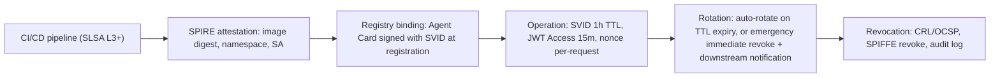
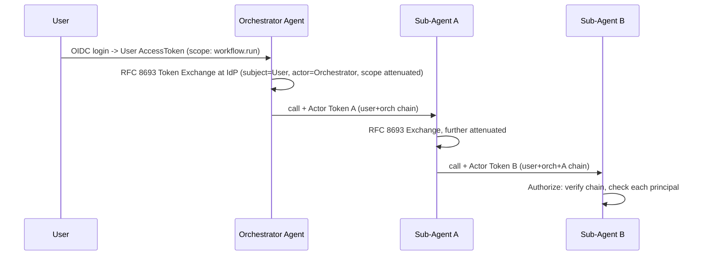

Continuing from [Part 1](../02-a2a-security-governance.md) (executive summary and full threat model): this part covers agent identity, authentication, authorization, delegation/OBO, agent discovery and trust, Agent Card governance, and capability governance.

## Agent Identity

Identity mechanisms trade off differently across ephemerality, attestability, cross-cloud fit, federation, rotation, and enterprise readiness. SPIFFE/SPIRE SVIDs are ephemeral (configurable TTL), attestable via workload attestation, federate natively across clouds via SPIFFE Federation, rotate automatically, and carry CNCF-standard high enterprise readiness. X.509 PKI certificates are configurable-lifetime, partially attestable via CA trust chain, cross-cloud via cross-cert or bridge CA, manually or ACME-rotated, and proven at scale. OAuth client credentials are long-lived (not ephemeral), not attestable, federate via OIDC, rotate manually, but have broad support. Cloud-native managed identity (Azure/AWS/GCP) is platform-managed and attestable via platform metadata but is cloud-specific with no native cross-cloud fit, federating only via OIDC. Kubernetes Service Account token projection is ephemeral and K8s-API-attestable but is K8s-native only, bridging to SPIFFE for wider federation. PASETO offers no ephemerality or attestation — it's a token encoding, not an identity mechanism. Hardware-backed identity (TPM/HSM) gives the highest assurance via hardware attestation but requires hardware and federates only via HSM federation. Workload Identity Federation (GCP/AWS/Azure) is ephemeral, OIDC-attestable, designed for cross-cloud, natively federated, and automatically rotated — high cloud-native A2A readiness.

*The agent identity lifecycle: issuance from an attested CI/CD build through operation, rotation, and revocation.*

For enterprises spanning AWS, Azure, and GCP, OIDC-based Workload Identity Federation bridges the clouds: SPIRE issues a JWT-SVID (universal workload identity), each cloud's WIF endpoint accepts it as a trusted OIDC assertion, cloud-native short-lived credentials are exchanged (STS, GCP STS, Azure Managed Identity), and no long-lived cross-cloud secrets ever exist — eliminating per-cloud credential stores while keeping cloud-native authorization semantics.

## Authentication

Selecting a mechanism depends on the call pattern: mTLS plus SPIFFE is the highest-fit choice for A2A calls (inherent mTLS, implicit token binding via TLS); OAuth 2.1 Client Credentials fits A2A and platform-to-agent flows at high enterprise fit with optional mTLS and DPoP binding; OIDC user-delegated flows fit user-to-agent and partial A2A; DPoP-bound JWTs fit broadly across A2A, user-to-agent, and platform flows with explicit token binding; PASETO v4 public and plain client certificates both fit A2A and platform flows at medium-to-high enterprise readiness; SPIFFE JWT-SVIDs fit A2A and platform flows at high readiness without mandatory mTLS; API keys are legacy-only and should be retired; hardware-backed (TPM) authentication is reserved for high-value niche cases.

Recommended stack by scenario: same-trust-domain A2A uses mTLS with SPIFFE SVIDs; cross-domain A2A adds OAuth 2.1 Client Credentials plus DPoP on top of mTLS; user-delegated (OBO) flows use OIDC plus RFC 8693 Token Exchange; agent-to-cloud-API calls use Workload Identity Federation into cloud-native STS; legacy system integration uses Vault-brokered credential issuance so the agent itself never holds a secret.

## Authorization

Six authorization models suit different A2A needs: RBAC is simple and auditable but too coarse for fine A2A control; ABAC is context-rich and medium-fit for cross-cutting attributes; PBAC is flexible, auditable, and high-fit for regulated environments; ReBAC (Zanzibar-style) is relationship-aware and high-fit for complex ownership hierarchies at very high scale; OpenFGA delivers ReBAC open-source, Google-Zanzibar-style without Google; OPA (Rego) delivers policy-as-code at high fit for infrastructure-level enforcement; Cedar (AWS) delivers type-safe policies with formal verification, high-fit for AWS-native regulated environments; AWS Verified Permissions is a managed Cedar-hosted option.

Four A2A-specific authorization patterns matter. Agent authorization is a pre-admission gateway check, not an agent-local one: before any call is processed, the gateway evaluates whether the calling agent's authorized capability set includes the requested operation. Delegated authorization, when Agent A delegates to Agent B on behalf of User U, must evaluate Agent A's permissions, User U's permissions, and their intersection — the delegation can never grant more than both principals independently hold. Cross-domain authorization for agents in Business Domain A calling Domain B requires an explicit policy owned by the domain architecture board, defaulting to deny. Dynamic authorization uses ABAC attributes (time of day, data classification, geographic location, calling-agent risk score, current incident status) evaluated at runtime by the policy engine.

## Delegation and On-Behalf-Of (OBO)

Pattern selection depends on scenario: a user-initiated multi-step workflow uses RFC 8693 Token Exchange (OBO) so user identity remains traceable through the chain for audit and authorization; scheduled background tasks use the agent's own service identity with no OBO, since there's no live user session; cross-department collaboration uses OBO with scope attenuation to preserve accountability while narrowing scope per hop; third-party agent integration uses service identity plus explicit consent, since OBO from an external IdP adds unnecessary complexity; multi-cloud agent chains use SPIFFE JWT-SVID exchanged into cloud WIF to avoid multi-cloud OBO complexity.

*Each hop calls the authorization server for token exchange — no self-minted delegation tokens — and every exchanged token carries the full delegation chain in its `act` claim.*

Key invariants: scope must narrow or stay equal at each hop, never expand; and the authorization server enforces a maximum chain depth, rejecting exchange beyond it — for example, depth 0 (the user) holds full scope, depth 1 narrows to `workflow.read` plus `workflow.write`, depth 2 narrows further to `workflow.read` only, and depth 3 is rejected outright as exceeding the maximum.

## Agent Discovery and Trust

The discovery architecture centers on an enterprise agent registry (signed Agent Cards via Ed25519/ES256, a semantic capability index, trust tier metadata, approval workflow state, and a revocation list) behind an mTLS/SPIFFE-authenticated discovery gateway that verifies the caller's SVID, enforces discovery ACLs, filters by trust tier/domain/status, and short-TTL-caches (5 minutes plus ETag) responses to individual requesting agents.

Trust establishes in five steps: registration (the publisher submits a card plus signing-key attestation via an authenticated CI/CD pipeline; the registry validates schema compliance, duplicate detection, capability contract consistency, and security policy); approval (a governance workflow triggers human review for new registrations and capability expansions, with security sign-off and domain architect approval of capability claims); publication (the registry signs the card with its own key, creating a chain from publisher key through registry CA to card signature, which callers verify in full); discovery (the gateway enforces the caller's discovery authorization — a low-trust agent cannot discover high-trust agents — and returns signed cards plus registry signature); and pre-call verification (the caller verifies signature and revocation status and establishes mTLS to the declared endpoint, confirming the endpoint certificate matches the card's declared SPKI).

Static hardcoded endpoints suit only small, stable deployments or critical stable agent pairs, since they carry no discovery attack surface but also no discovery. Registry-based dynamic discovery is the default for all new enterprise-scale deployments, accepting that discovery itself becomes a critical path requiring the controls above. Broadcast/multicast discovery is open to spoofing and prohibited in production. DNS-based (SRV record) discovery is acceptable as a transport layer for service mesh integration, provided DNSSEC is required and the fetched card is always independently verified.

## Agent Card Governance

Cards move through a lifecycle: Draft → Review (security review plus SBOM) → Approved (domain architect sign-off) → Published (registry CA signs plus version) → Deprecated (90-day migration notice) → Revoked (immediate revocation plus CRL update), with a rejection path looping back to a remediation cycle. Governance controls by field: `name` uniqueness and namespace convention (org.domain.agent-name) is enforced by the registry team; `capabilities[]` must be proven via automated capability test, with false declarations triggering rejection, owned by the domain architect; `authentication` must reference an approved mechanism with no API keys permitted, owned by the security architect; `serviceEndpoint` must be a registered approved endpoint (no direct IPs, TLS required), owned by platform engineering; `skills[]` must reference an approved skill contract version, owned by the capability governance board; `version` enforces semantic versioning with a major bump for breaking changes, owned by the agent owner; `expires` caps at 1 year with re-approval required for renewal, owned by the registry team; `signature` is mandatory and automatically enforced by the registry.

Schema evolution follows a graduated process: minor backward-compatible additions are auto-approved with diff review; major breaking changes get a full review cycle with the old version maintained through deprecation; emergency security fixes get an expedited 4-hour review with security team override authority; capability removals require a minimum 90-day deprecation notice with consuming-agent migration confirmation.

## Agent Capability Governance

Every published capability needs a corresponding capability contract specifying its identity/version/owner, SLOs (availability, p99 latency, error budget), input/output schemas with data classification, required permissions, and allowed callers by trust tier — for example, a credit-check capability might declare 99.9% availability, a 500ms p99 latency, `credit.read` plus `customer.pii.read` permissions, and require OBO from INTERNAL or PARTNER trust tiers only. Governance ownership splits across six domains: the capability registry (schema validation, versioning, publication) sits with Platform Engineering; SLO definition sits with the capability owner team; security review (permission and data classification approval) sits with Security Architecture; domain authorization (allowed-caller approval, cross-domain policy) sits with the Domain Architect; compliance validation (PCI, HIPAA implications) sits with the Compliance team; and deprecation management sits jointly with the capability owner and Platform Engineering.

## Related

- [A2A Security & Governance (1 of 5)](../02-a2a-security-governance.md)
- [A2A Security & Governance (3 of 5)](02-a2a-security-governance-part3.md)
- [Agent Communication, Identity & AI Gateway](../03-agent-communication-identity-gateway.md)
