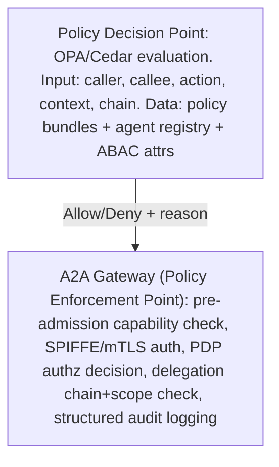
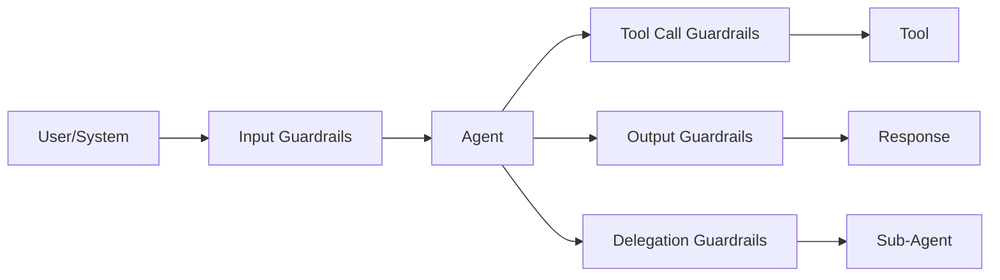

Continuing from [Part 2](02-a2a-security-governance-part2.md) (identity, authentication, authorization, delegation, discovery, card/capability governance): this part covers protocol and payload security, the anti-pattern catalog, versioning, policy engines, guardrails, and agent trust scoring.

## Protocol Security

Transport requirements: TLS 1.3 minimum (1.2 with strong ciphers only where 1.3 isn't feasible), TLS_AES_256_GCM_SHA384 and TLS_CHACHA20_POLY1305_SHA256 cipher suites, full chain validation with OCSP stapling and CT log monitoring, mandatory mTLS for all A2A communication, and certificate lifetimes capped at 90 days for servers and matching SVID TTL (under 1 hour) for mTLS clients.

High-risk payloads require message-level signing beyond transport security — a signature over `X-Request-ID + X-Request-Timestamp + X-Request-Nonce + SHA-256(body)`, computed with the sender's SVID private key and verified by the recipient before processing. Replay protection uses a 5-minute (configurable) nonce window backed by Redis with matching TTL, 128-bit cryptographic random nonces, ±30-second timestamp tolerance, and rejection on duplicate nonce, stale timestamp, or invalid signature.

## Payload Best Practices

Cap payload size at 1MB by default (10MB with explicit approval) to prevent amplification and force chunking discipline. Use A2A Server-Sent Events for long-running tasks with 64KB chunks for progress visibility without timeout risk. Disable compression by default, enabling per-route only with content negotiation, since CRIME/BREACH-style attacks target compressed-plus-encrypted payloads carrying sensitive data. Encode binary payloads as base64 within JSON or multipart — never raw binary in a task body — since schema validation requires structured data. Validate against JSON Schema at the gateway ingress before routing, rejecting malformed payloads before they reach agent logic. Tokenize PII before inclusion and detect it with DLP on egress, since cross-agent payloads are a data leakage surface. Include only fields the receiving agent declared in its input schema, reducing both attack surface and payload size. Require idempotency keys for all state-mutating operations to enable safe retry without double-execution.

## HTTP Header Best Practices

Required A2A request headers: `Authorization` (DPoP-bound bearer token or mTLS fallback); `X-Request-ID` (a UUID v4 for cross-service correlation); `X-Delegation-Chain` (depth and agent IDs for loop detection); `X-Idempotency-Key` (UUID v4 for safe retry); `X-A2A-Version` (protocol version negotiation); `traceparent` (W3C Trace Context); `X-Request-Timestamp` and `X-Request-Nonce` (replay protection). Security response headers should include HSTS with preload, `X-Content-Type-Options: nosniff`, `X-Frame-Options: DENY`, a restrictive Content-Security-Policy, and `Cache-Control: no-store`.

Reverse proxy considerations vary by product: Envoy strips custom headers by default and requires configuring a header allow-list, using `envoy-spiffe-tls` for mTLS termination plus SPIFFE integration; NGINX can't natively verify DPoP proofs, so verification should be offloaded to an OPA sidecar; AWS ALB strips `X-Forwarded-*` headers unless explicitly forwarded and doesn't terminate mTLS in the listener, so an NLB should carry mTLS passthrough with ALB reserved for TLS-terminated paths; Azure Application Gateway supports mTLS but its WAF may reject valid A2A JSON payloads without tuning; GCP Cloud Load Balancer supports certificate-based mTLS via Trust Config referencing a SPIFFE CA, enabling fleet-wide mTLS without per-agent certificate management.

## Anti-Pattern Catalog

Trust anti-patterns: agents trusting every other agent (any compromise enables trivial lateral movement — fix with an explicit per-agent allow-list and deny-by-default trust); unlimited delegation depth (confused deputy at arbitrary depth, infinite loop risk — fix by enforcing a maximum of 5 hops); shared credentials across agents (any credential compromise's blast radius equals every agent sharing it — fix with a unique SVID per agent); root/admin permissions for agents (agent compromise becomes full system compromise — fix with least privilege and JIT elevation requiring human approval); direct database access from agents (bypasses the authorization layer, no audit trail, SQL injection surface — fix by routing through managed data agents or APIs); and hardcoded trust like `agent_id == "agent-a" -> trust` (not revocable, brittle, spoofable by name — fix with dynamic policy evaluation keyed on certificate identity, not name).

Discovery anti-patterns: no capability validation (an agent silently or dangerously fails on tasks it can't handle — fix by validating incoming tasks against the declared input schema); unsigned Agent Cards (forgeable in transit — fix with mandatory Ed25519 signatures verified on every fetch); and dynamic prompt construction from discovery metadata (injecting undeclared card fields into prompts is prompt injection via the registry — fix by never injecting undeclared fields, using typed parameters only).

Operational anti-patterns: no audit logging (forensics becomes impossible, compliance fails — fix with a structured audit log for every call); no sub-agent-level authorization (assuming the orchestrator already checked invites confused deputy — fix by having every agent check independently, trusting no caller by default); oversized tokens (JWT bloat, header limits, performance loss — fix with claim-by-reference introspection); missing schema validation (payload manipulation, injection via malformed input — fix with gateway-level JSON Schema validation); blind tool execution (executing tool results without validation enables output poisoning — fix by validating against the declared output schema); and circular delegation (A→B→C→A loops until overflow or timeout — fix with delegation chain ID tracking that rejects a repeated own-ID).

## Versioning

Six artifact classes need explicit versioning: the A2A protocol itself (semantic versioning negotiated via the `X-A2A-Version` header, breaking on any change to mandatory fields/auth/schema); Agent Cards (semantic versioning in the card's `version` field, breaking on capability removal/auth change/endpoint change); Agent APIs (URL-embedded version with header fallback, breaking on parameter removal or response schema change); capability contracts (semantic versioning published in the registry, breaking on input schema change/SLO degradation/permission expansion); policy schemas (hash-identified, rollback-capable versions, breaking on any change that would deny previously-allowed operations); and memory schemas (versioned storage namespaces, breaking on structural data format change).

A rolling upgrade runs five phases: deploy the v2 agent handling both v1 and v2 requests; update the Agent Card to declare v2 preferred and v1 still supported; monitor for 30 days confirming no v1 callers remain in traces; update the card to declare v2-only with v1 deprecated; and after the deprecation period, drop the v1 handler entirely.

## Policy Engines

Six engines suit different needs: OPA/Rego offers flexible, widely-adopted, bundle-distributable runtime evaluation, best for infrastructure policies, Kubernetes, and general A2A, at the cost of a Rego learning curve and scale-dependent performance; Cedar (AWS) offers type-safe, formally-verifiable, human-readable declarative policy with runtime-plus-pre-validation evaluation, best for AWS-native and compliance-critical policies, though AWS-centric with a smaller ecosystem; OpenFGA offers graph-based ReBAC scaling to billions of relationships via runtime API, best for hierarchical ownership and sharing, though it's relationship-only, not general policy; Permit.io offers a managed YAML/UI service combining RBAC/ABAC/ReBAC for teams without policy-as-code expertise, at the cost of vendor dependency; AWS Verified Permissions offers managed Cedar tightly integrated with AWS but AWS-only; Styra DAS offers enterprise OPA with a governance UI for OPA at scale, at added cost.

Policy lifecycle: authoring as code in Git with Rego unit tests or Cedar formal verification; CI/CD linting, test coverage gates, and impact analysis of which decisions change; staging in shadow mode logging PDP decisions without enforcing, compared against a production baseline; gradual production rollout with feature flags monitoring decision rate changes; versioned policy bundles supporting under-60-second rollback; and every PDP decision logged with policy version, input context, and output reason.

## Guardrails

Guardrail types by placement: prompt guardrails on the input path (AI Gateway, NeMo Guardrails, Guardrails AI) block injection, jailbreak, and policy-violating instructions; output guardrails on the output path (AI Gateway, an LLM-based classifier) block PII leakage, harmful content, and exfiltration indicators; inter-agent message guardrails at the A2A Gateway (content classifier plus schema validator) block cross-agent injection, oversized payloads, and schema violations; delegation guardrails at the token exchange endpoint (the authorization server) block excessive scope and depth-limit violations; safety guardrails in the agent runtime (constitutional AI constraints) block irreversible-consequence actions and harm indicators; compliance guardrails in the data plane (a DLP engine) block PCI/PHI data leaving its authorized boundary; and human approval workflows at action execution (an HITL gate) block irreversible actions above a risk threshold or of a novel type.

Placement trades latency against bypass risk: agent-local guardrails add minimal latency but cover only a single agent and carry high bypass risk since agent code can disable them — use only as a defense-in-depth layer, never primary. Gateway guardrails add low latency (5-20ms), cover all A2A traffic, and carry low bypass risk since the gateway is a separate process — this is the primary enforcement point. Orchestrator guardrails add low latency, cover orchestrated workflows, and carry medium bypass risk since the orchestrator is still application code — a secondary layer covering non-gateway paths. Runtime sidecar guardrails add minimal latency with per-pod coverage and low bypass risk, complementing the gateway in Kubernetes deployments.

## Agent Trust Scoring

A continuous 0.0-1.0 trust score, recalculated hourly, weights six factors: identity assurance (25%, measured by SPIFFE attestation level and hardware- versus software-backed identity); software supply chain (20%, SLSA level, SBOM completeness, vulnerability scan results); behavioral history (20%, deviation from declared capabilities, error rates, anomaly flags); governance status (15%, approval recency, pending security reviews, owner responsiveness); runtime attestation (10%, confidential computing attestation, TEE verification); and dependency health (10%, known CVEs in the SBOM, dependency staleness). Authorization policies can require minimum trust score thresholds for sensitive operations.

For agents handling financial transactions, PHI, or cryptographic material, trusted execution environments add hardware-rooted assurance: AMD SEV-SNP or Intel TDX confidential VMs, a SPIRE attestation plugin validating TEE measurement before issuing an SVID, memory encryption preventing the host operator from reading agent state, and a remote attestation report included in token exchange for verifier confirmation.

## Related

- [A2A Security & Governance (2 of 5)](02-a2a-security-governance-part2.md)
- [A2A Security & Governance (4 of 5)](02-a2a-security-governance-part4.md)
- [Agentic AI Security Guardrails](../04-agentic-ai-security-guardrails.md)
