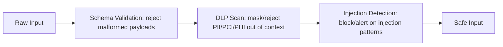
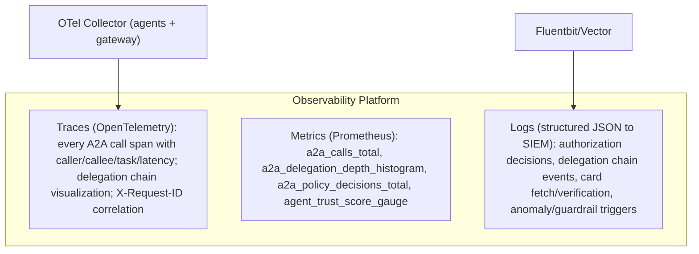
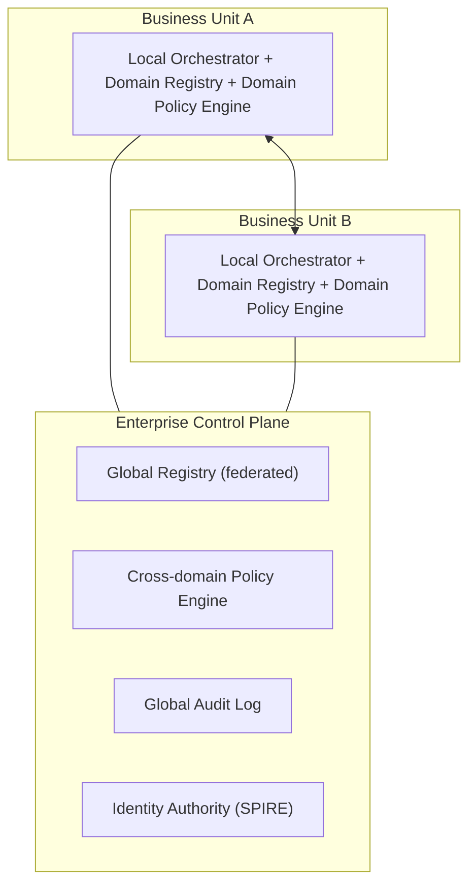

Continuing from [Part 3](02-a2a-security-governance-part3.md) (protocol/payload security, anti-patterns, versioning, policy engines, guardrails, trust scoring): this part covers responding to agent changes, failover and resilience, input/output sanitization, content trust, observability, and enterprise reference architectures.

## Responding to Agent Changes

Change type drives detection mechanism and response: a capability addition (detected via Agent Card diff/registry audit) triggers a shadow registry update and consumer notification, requiring human approval for the new capability; a capability removal (card diff) triggers a grace-period consumer notification and deprecation workflow, requiring impact-assessment review; an API schema change (schema registry diff, contract test failure) blocks deployment if breaking and notifies consumers, requiring review if breaking; an owner change (registry update) triggers a transfer approval workflow and security re-review, always requiring review; a model change (version bump, behavioral regression test) triggers canary deployment and A/B behavioral comparison, requiring review if behavior changes significantly; a policy change (policy bundle version change, PDP shadow mode) triggers shadow evaluation and an impact report, requiring review if impact exceeds threshold; a permission expansion (scope diff in the capability contract) blocks auto-approval and always triggers security review; and behavioral drift (OTel trace analysis, baseline deviation) triggers an alert, investigation, and trust score penalty if drift exceeds threshold.

Every agent publishes consumer-driven contract tests against each capability it consumes, specifying the input schema subset used, expected output schema fields, expected error handling, and the maximum latency SLO depended on. When a published API changes, contract tests for all registered consumers run automatically, and a breaking test blocks the deployment.

## Failover and Resilience

Failure modes and their patterns: an agent instance crash/OOM/eviction causes task failure, mitigated by retry with exponential backoff plus jitter and a circuit breaker to an alternative instance; registry unavailability blocks new discovery, mitigated by a read-through cache (5-minute TTL), a static fallback for critical agents, and fail-closed behavior on new agent introduction; SPIRE unavailability blocks SVID renewal, mitigated by pre-renewal at 75% of TTL, caching valid SVIDs, and a 3-server SPIRE HA cluster; OPA unavailability blocks all calls if fail-closed, mitigated by 3-replica OPA HA, pre-compiled locally-cached policy bundles, and per-sensitivity-tier fail-open/closed configuration; and OAuth authorization server unavailability breaks OBO delegation, mitigated by caching OBO tokens for their full TTL, caching the JWKS endpoint, and fail-closed for new delegation.

A circuit breaker runs three states: CLOSED (normal operation, tripping to OPEN after 5 failures in 60 seconds), OPEN (fast-failing all calls to the failed agent, moving to HALF-OPEN after a 30-second recovery timeout), and HALF-OPEN (a single probe call — success returns to CLOSED, failure returns to OPEN). Implement at the A2A gateway layer (Envoy circuit breaker or an application-layer equivalent), propagating state to other gateway replicas via shared state (Redis).

For multi-region resilience, an active primary region (A2A Gateway, Registry primary, SPIRE HA, OPA cluster) pairs with an active-standby DR region running the same stack, fronted by a global load balancer doing health-based failover; registry replication runs asynchronously with a maximum 30-second lag and CRDT-based conflict resolution for concurrent writes.

## Input and Output Sanitization

Controls by input type: prompts/instructions get an injection classifier, jailbreak detection, and length limit (Guardrails AI, NeMo Guardrails, Llama Guard); JSON payloads get schema validation, field length limits, and type enforcement (AJV, JSON Schema validators at the gateway); markdown gets executable-content stripping and HTML sanitization (DOMPurify, markdown-it with sanitize option); code gets sandboxed execution, AST analysis, and banned dangerous functions (Firecracker microVMs, CodeShield); agent-generated SQL is restricted to parameterized queries, never string concatenation from agent output (ORM enforcement, query analyzer); external web content gets classified before ingestion with no executable content permitted (browser sandbox, content policy); file content gets malware scanning, MIME verification, and safe extraction (ClamAV plus cloud AV, Apache Tika).

Gitleaks- or TruffleHog-equivalent scanning should run on every inter-agent message payload at the gateway before routing, detecting API keys (entropy plus regex), JWTs (structure plus sensitive claim detection), credit card numbers (Luhn validation), SSNs and passport numbers, private key material, and database connection strings — a detected secret triggers a log alert (never logging the secret itself), payload rejection, and a security incident.

## Content Trust

A2A responses carrying data that informs downstream decisions should include a provenance block alongside the data: the responding agent's SPIFFE ID and SVID fingerprint, the model ID and version that generated it, a timestamp, a content hash, and an Ed25519 signature covering the content hash and timestamp. Orchestrators receiving sub-agent responses verify four things before trusting them: the signature against the agent's SPIFFE SVID public key, that the content hash matches the actual data, that the timestamp falls within an acceptable window (preventing stale-data replay), and that the agent's SVID isn't on the revocation list.

## Observability

Maintain a real-time directed agent interaction graph — nodes are agent instances identified by SPIFFE SVID, edges are A2A calls weighted by frequency and data volume, with metadata on task types, delegation depth, and per-edge error rate. Anomaly detection on this graph catches new edges (unexpected interactions), subgraph isolation breaks (an agent calling outside its expected cluster), high-degree nodes (potential amplification in progress), and cycles (delegation loops).

Key security events to forward to SIEM, mapped to MITRE ATT&CK: Agent Card signature verification failure (HIGH, T1553 Subvert Trust Controls); delegation depth exceeded (MEDIUM, T1134 Access Token Manipulation); discovery of an undeclared agent (MEDIUM, T1046 Network Service Discovery); nonce replay detected (HIGH, T1539 analogous to Steal Web Session Cookie); trust score drop below threshold (MEDIUM, TA0004 Privilege Escalation); schema validation failure on an inter-agent message (MEDIUM, T1059 Command and Scripting Interpreter); and a new agent registered outside business hours (HIGH, T1078 Valid Accounts).

## Enterprise Reference Architectures

A central orchestrator pattern routes all delegation through a single high-trust orchestrator holding the OBO token, which delegates via RFC 8693 to domain sub-agents and aggregates results back to the user — governance concentrates at the single choke point, but the orchestrator becomes a single point of failure whose scope must stay minimal. A federated enterprise pattern gives each business unit its own local orchestrator, domain registry, and domain policy engine, all connected to an enterprise control plane holding a federated global registry, a cross-domain policy engine, a global audit log, and a SPIRE identity authority.

A banking reference architecture routes the customer channel through an API gateway into a customer-facing orchestrator, which dispatches to a Tier-1-trust KYC Agent and Risk Agent plus a Tier-2-trust Product Agent; PCI agents sit in an isolated network segment, OBO carries customer identity for audit, every A2A call logs to an immutable ledger, HITL gates transactions above a risk threshold, and DORA resilience targets a 4-hour RTO and 1-hour RPO for critical agents. A healthcare reference architecture routes clinician/system input through a Clinical Orchestrator to PHI-authorized Diagnostic, Treatment, and Records agents, all within a HIPAA boundary keeping PHI inside the VPC, requiring a BAA for any agent provider, de-identifying data before any cross-boundary transfer, and logging who accessed what for whom with 6-year retention — identity flows from clinician OIDC through OBO down the agent chain, authorized by clinical role plus patient relationship.

Air-gapped deployments for government/defense environments run entirely on-premises Kubernetes with no cloud API calls: a local OCI registry (Harbor) with manual sync, on-premises SPIRE with an HSM-backed CA, an on-premises OAuth AS (Keycloak), OPA with policy bundles distributed via secure USB/air-gap transfer, fully on-premises observability (Prometheus, Grafana, OpenSearch — no cloud telemetry), and signed offline update packages verified before application. Multi-cloud deployments run separate agent fleets per cloud (EKS+SPIRE on AWS with Bedrock models, AKS+SPIRE on Azure with Azure OpenAI, GKE+SPIRE on GCP with Vertex AI), bridged by SPIFFE Federation between trust domains — each region's SPIRE server federates with the others via signed bundle exchange, so agents in any region authenticate to agents in any other region using their SVID, behind a cloud-neutral global A2A gateway, global OPA policy engine, and replicated global registry.

## Governance Operating Model

Onboarding runs a five-stage pipeline: the developer submits an Agent Card plus SBOM; automated checks (5 minutes — schema validation, capability contract existence, SBOM completeness, vulnerability scan, duplicate detection) gate on pass/fail; security review (24-hour SLA — auth mechanism approval, permission scope review, data classification alignment, threat model adequacy); Domain Architect review (48-hour SLA — capability claims verification, cross-domain impact assessment, SLO feasibility); and dual-sign approval leading to registry publication.

Lifecycle stages carry distinct ownership and review triggers: Active (agent owner, quarterly security review plus change-triggered review); Deprecated (agent owner plus Platform Engineering, consumer migration tracking with a forced sunset date); Suspended (security team, triggered by a security incident or a trust score below 0.3); Retired (registry team, once all consumers migrate, 90 days post-deprecation); Emergency revocation (security architect, for a zero-day or confirmed compromise, targeting under 1 hour).

Risk tiers scale controls to criteria: Tier 1 Critical (PCI data, PHI, financial transactions, identity management) requires HSM-backed identity, TEE, human HITL, real-time monitoring, and quarterly pentest; Tier 2 High (PII, internal financial data, regulated workflows) requires SPIFFE SVIDs, strong auth, daily audit review, and annual pentest; Tier 3 Medium (internal operational data, non-regulated workflows) requires standard SPIFFE, automated auth, and weekly audit review; Tier 4 Low (public data, read-only, no sensitive context) permits OAuth client credentials with monthly audit review.

## Related

- [A2A Security & Governance (3 of 5)](02-a2a-security-governance-part3.md)
- [A2A Security & Governance (5 of 5)](02-a2a-security-governance-part5.md)
- [Air-Gapped AI Infrastructure for Enterprise Banking](../01-airgapped-banking-infrastructure.md)
