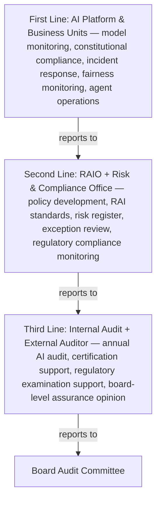
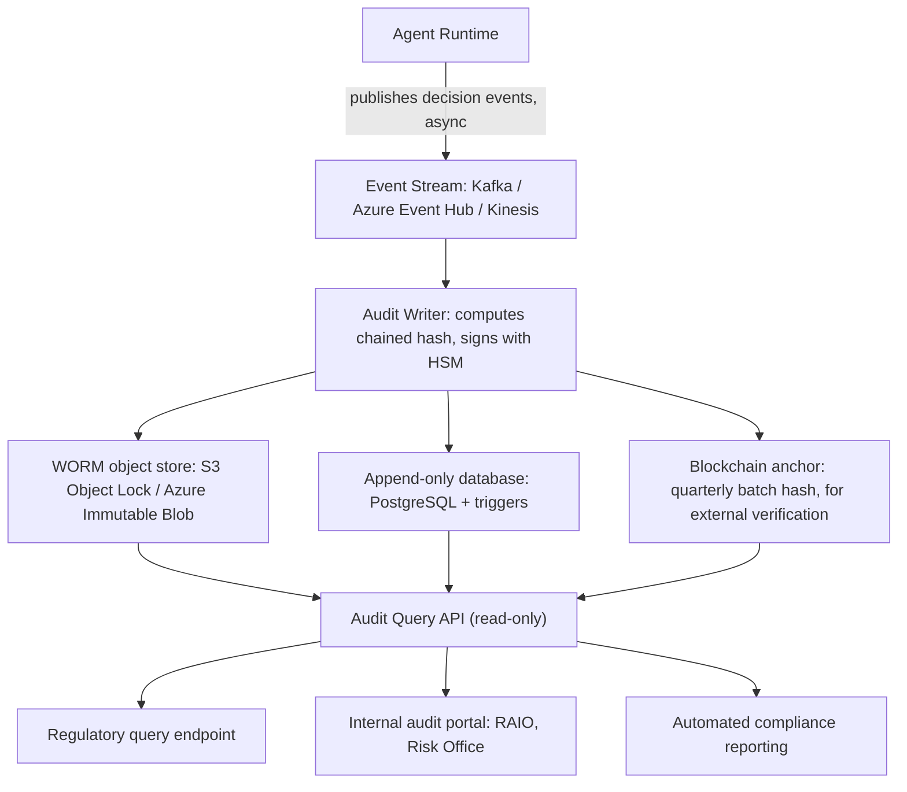

**Audience:** AI risk officers, internal audit, external auditors, AI governance leads, regulators. **Purpose:** Design the AI assurance framework (three lines of defense), AI audit ledger architecture, explainability requirements, and constitutional traceability systems.

## AI Assurance Framework

AI assurance is the structured process of building justified confidence that an AI system behaves as intended, within its constitutional constraints, in compliance with regulation, and safely across its operational lifecycle. Assurance differs from testing: testing verifies specific behaviors at a point in time, while assurance provides continuous evidence the system remains trustworthy across its operational lifetime.

The assurance evidence hierarchy runs four levels: Level 1, design-time evidence (model cards, AI Impact Assessments, architecture records, constitution documents, training data audits, ARB approvals); Level 2, operational evidence (continuous production monitoring — fairness metrics, constitutional compliance rates, drift indicators, incident logs, kill switch test results); Level 3, independent audit (internal or external audit reviewing evidence against governance standards, issuing a formal opinion); Level 4, independent certification (an external auditor certifying the system against ISO 42001, EU AI Act conformity assessment, or a sector standard).


*Three lines of defense for AI: operational ownership, independent risk oversight, and independent assurance, each reporting up to the next.*

Assurance framework components: an AI Impact Assessment (pre-deployment risk/benefit analysis, owned by the RAIO before each significant deployment); a Model Card (documented performance/limitations/intended use per model version, ML team plus RAIO); an AI FactSheet/System Card (system-level documentation per deployment, Solution Architect plus RAIO); a Fairness Evaluation Report (statistical fairness across demographic groups, monthly automated plus quarterly human review, RAI Engineering); a Constitutional Compliance Report (weekly, RAI Engineering); an Adversarial Robustness Test (quarterly red-team results, AI Security); an Operational AI Audit (annual internal, bi-annual external, Internal Audit); and a Conformity Assessment (EU AI Act or ISO 42001 certification, as required, External Auditor).

## AI Audit Ledger Architecture

The AI audit ledger is an immutable, tamper-evident record of every consequential AI decision, providing the evidence chain regulators, courts, and governance bodies require. Each decision record captures six blocks: a decision header (record ID, timestamp, session ID, model ID, constitution version in effect, system version); a reasoning trace (chain-of-thought if captured, retrieved RAG documents with relevance, ordered tool calls, constitutional checks evaluated, OPA/Cedar policy decisions); a memory access log (memories read/written with content hashes, retention classification); a tool call log (per call: tool ID/version, input/output hashes rather than raw content for privacy, authorization check result, execution sandbox ID); outcome and oversight (final output hash, human override flag and ID, escalation trigger and reason, violated constitutional principles, approval requirement and grantor identity hashed); and integrity fields (a chained hash to the previous record for tamper evidence, this record's own hash, and an HSM-backed cryptographic signature).


*Decision events flow asynchronously from the agent runtime through a signed, chained write path into immutable storage, exposed only via a read-only query API.*

Retention policy scales with system tier: SL4/Tier 1 Critical systems retain 10 years (EU AI Act Art. 12; SR 11-7); SL3/Tier 2 Significant retain 7 years (GDPR; DORA; MiFID II); SL2/Tier 3 Standard retain 3 years (internal policy); SL1/Tier 4 Minimal retain 1 year (internal policy).

## Explainability Architecture

Explainability requirements vary by stakeholder: an individual user needs plain-language explanation under 200 words within 30 days of request; a regulator needs technical and non-technical documentation (a model card) before deployment and on examination; a court needs the full reasoning trace reconstructed from the audit ledger on order; the board/audit function needs a dashboard and summary metrics quarterly; internal audit needs full audit ledger access annually.

Local (decision-level) explainability methods: SHAP assigns each input feature a contribution score for a specific prediction, the most widely adopted method for tabular models like credit and risk:

```python
import shap
explainer = shap.TreeExplainer(credit_model)
shap_values = explainer.shap_values(applicant_features)
shap.plots.waterfall(shap_values[applicant_idx])
# "Income (+0.32 probability), Credit history (-0.15), Employment status (+0.08), ..."
```

LIME fits a simple interpretable model locally around a specific prediction, more flexible than SHAP for non-tabular data. For LLM-based agents, chain-of-thought logging captures the model's own reasoning trace as a direct explanation, without post-hoc approximation.

Global (model-level) explainability covers feature importance (which inputs most influence predictions overall), partial dependence plots (how each feature affects output across its range), model cards (documented intended use, performance, limitations, biases), and behavioral testing (a CheckList-style test suite covering capabilities and failure modes).

Constitutional traceability answers, for a given output: which principles were evaluated, which triggered, and what action resulted?

```yaml
constitutional_trace:
  decision_id: "DEC-2026-07-06-001234"
  principles_evaluated:
    - principle_id: P1
      principle: "Never expose customer PII"
      triggered: false
      evidence: "No PII detected in output"
    - principle_id: P3
      principle: "Never recommend unsuitable products"
      triggered: true
      action: BLOCKED
      evidence: "Suitability score 0.23 < threshold 0.7"
  escalation_triggered: false
  final_disposition: BLOCKED
  constitutional_classifier_version: "v2.3.1"
```

This record lives in the audit ledger and links every blocked or modified output back to the specific constitutional principle that triggered the intervention.

## AI Certification Models

ISO 42001:2023, the international standard for AI Management Systems, specifies requirements for establishing, implementing, maintaining, and continually improving an AIMS. Key clauses for assurance: 6.1 (risk and opportunity assessment — an AI risk register and assessment methodology); 8.4 (AI system impact assessment documents); 9.1 (performance monitoring — metrics and fairness reports); 9.2 (internal audit reports and schedule); 9.3 (management review minutes); 10.2 (nonconformity and corrective action — incident log and corrective action records). Certification proceeds through gap assessment, remediation, a Stage 1 documentation-review audit, a Stage 2 operational-evidence audit, certification, and annual surveillance audits.

For High-Risk AI systems under the EU AI Act (Annex III), conformity assessment requires technical documentation (architecture, training data, performance metrics, risk management system, human oversight measures, security measures), a quality management system aligned to ISO 42001 or equivalent, EU database registration before deployment (Art. 49-50), post-market monitoring with incident reporting (Art. 72), and third-party audit for biometric identification, critical infrastructure, or high-impact employment decisions.

## Architect's Checklist

- [ ] **AU1** — Three lines of defense defined and operational for all Tier 1/2 AI systems
- [ ] **AU2** — AI audit ledger deployed: immutable, chained, cryptographically signed
- [ ] **AU3** — Audit ledger retention policy implemented per tier and regulatory requirement
- [ ] **AU4** — Local explainability (SHAP/LIME or CoT logging) for all consequential decisions
- [ ] **AU5** — Model cards published for all production AI systems
- [ ] **AU6** — Constitutional traceability record generated and stored for every decision
- [ ] **AU7** — Regulatory query API available to authorized regulators on request
- [ ] **AU8** — Internal audit schedule established; annual audit completed
- [ ] **AU9** — ISO 42001 certification plan in place for Tier 1 systems
- [ ] **AU10** — EU AI Act conformity assessment completed for all High-Risk AI systems in EU

## Related

- [Sovereign Constitutional AI Part 3: AI Governance Operating Model](03-ai-governance-operating-model.md)
- [Sovereign Constitutional AI Part 4: AI Risk Taxonomy](04-ai-risk-taxonomy.md)
- [Sovereign Constitutional AI Part 9: Policy-as-Code Framework](09-policy-as-code-framework.md)
