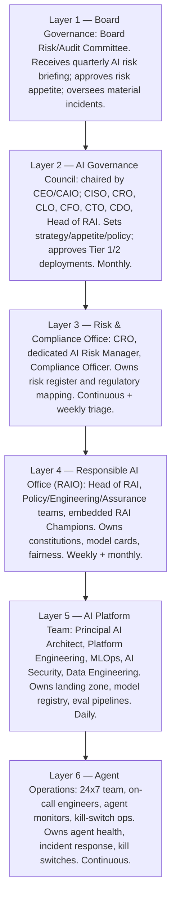
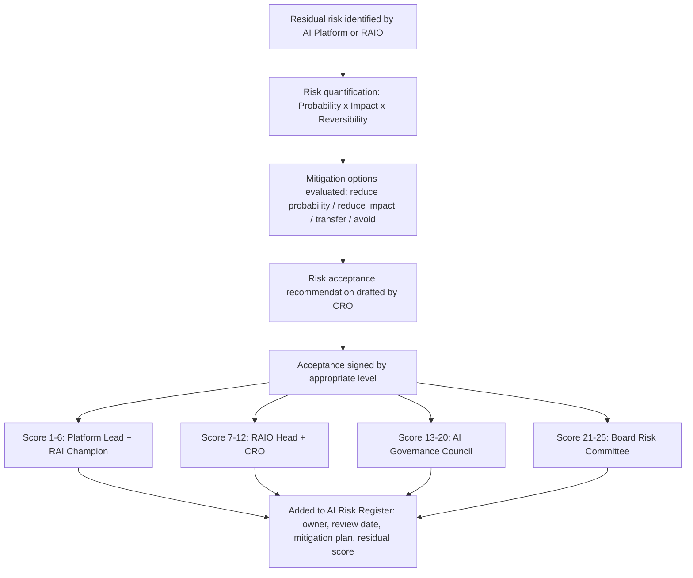
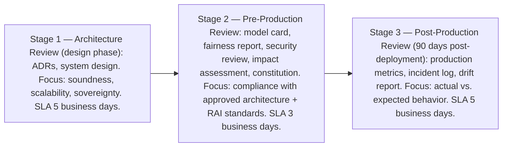
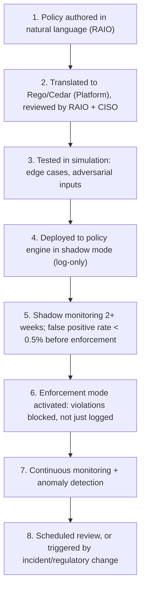

**Audience:** Chief AI Officers, enterprise architects, CROs, board members, legal and compliance leaders. **Purpose:** Design the complete AI governance operating model — from board accountability to agent operations — including governance functions, RACI, policy lifecycle, and board reporting.

## Governance Layers

The operating model spans six layers, from board fiduciary accountability down to day-to-day agent operations:

*Accountability flows from board-level fiduciary oversight down to continuous 24x7 agent operations, with each layer owning a distinct governance function.*

## Governance Functions

**Policy management.** The policy lifecycle runs: a trigger (regulation, incident, strategic need) drafted by the Policy Team, reviewed by Legal/Risk/Compliance/RAI/CISO, approved by the AI Governance Council, deployed via policy-as-code, then monitored (compliance rate, violation log) with exceptions handled ad hoc and folded back into policy updates when patterns emerge. The policy taxonomy: an AI Risk Appetite Statement (all AI, Board Risk Committee, annual review); AI Acceptable Use Policy (all staff, RAIO+Legal, annual); AI Development Standards (dev teams, Platform+RAIO, semi-annual); Agent Autonomy Policy (all agents, RAIO+CISO, quarterly); Data Sovereignty Policy (all AI data, CDO+Legal, annual); Model Risk Policy (all models, CRO+Platform, annual); AI Procurement Policy (vendor AI, Legal+CRO, annual); Incident Response Policy (operations, CISO+Platform, semi-annual).

**Model approval** runs a five-stage gated pipeline: Stage 1, registration (model card, training data provenance, fairness results, security review); Stage 2, risk-tier classification (Tier 1 Critical: high autonomy plus high-stakes; Tier 2 Significant: moderate autonomy or high-stakes; Tier 3 Standard: low autonomy or low-stakes; Tier 4 Minimal: advisory only); Stage 3, risk-tiered review (Tier 1 gets full Council plus external audit, Tier 2 gets RAIO+CRO+Platform, Tier 3 gets RAIO+Platform, Tier 4 gets RAI Champion+Platform); Stage 4, AI Impact Assessment sign-off (RAIO Head for Tier 1/2, RAI Champion for Tier 3/4); Stage 5, deployment authorization naming an accountable owner, approved autonomy level, monitoring requirements, review schedule, and kill switch contact.

**Agent approval** adds requirements beyond model approval given agents' autonomous, multi-step, tool-using nature: constitution compliance (agent constitution reviewed by RAIO, constitutional classifier deployed and tested); tool inventory review (all tools/MCP servers inventoried, risk-profiled, confirmed least-privilege); autonomy level enforcement (L0-L5 declared, policy engine enforces it, escalation paths tested); an operational kill switch (per-agent, under 5-minute reachability, documented on-call procedure, verified escalation chain); and memory/state governance (retention policy applied, PII handling reviewed, cross-session data governance confirmed).

Exception management scales by severity: a minor exception (parameter tuning) is logged and approved by RAIO+Platform Lead for up to 30 days; a standard exception (new tool, expanded data) needs a request form and RAIO+CRO approval for up to 90 days; a major exception (autonomy level increase) needs a full risk assessment and Council approval for up to 180 days; an emergency exception (incident response) needs verbal approval from CISO+RAIO with documented post-hoc review within 24 hours.

*Risk acceptance authority scales directly with the quantified severity score.*

Compliance monitoring runs continuously: real-time constitutional violation monitoring via policy engine alerts (violation dashboard output); daily fairness metric monitoring via the fairness pipeline (drift alert); continuous model performance monitoring via MLOps (degradation alert); weekly regulatory change monitoring (policy impact assessment); annual external audit for Tier 1, bi-annual for Tier 2; and regulatory examination as requested (multi-team response).

## AI Review Board (ARB-AI)

The technical governance body reviewing AI architectures, models, and agent deployments before production: chaired by the Principal AI Architect (technical authority), with an AI Security Architect (threat model review), RAI Champion (constitutional compliance), Data Architect (data governance/sovereignty), CRO Representative (risk scoring alignment), and a rotating Domain Expert.

## RACI Matrix

| Activity | Board | AI Gov Council | CRO | RAIO | Platform | Agent Ops |
| --- | --- | --- | --- | --- | --- | --- |
| AI risk appetite | A | C | R | C | I | I |
| AI constitution | I | A | C | R | C | I |
| Model approval (T1) | I | A | C | R | R | I |
| Model approval (T2/3) | I | I | C | A | R | I |
| Agent approval | I | I | C | A | R | I |
| Fairness monitoring | I | I | I | A | R | I |
| Kill switch (incident) | I | I | C | C | C | R, A |
| Risk acceptance (T1) | A | R | R | C | I | I |
| External audit | A | R | C | C | C | I |
| Policy lifecycle | I | A | C | R | C | I |
| Regulatory response | I | A | R | C | C | I |

*R = Responsible, A = Accountable, C = Consulted, I = Informed.*

## Policy-as-Code Lifecycle

AI governance policies must be executable, not just documented:

See [Policy-as-Code Framework](09-policy-as-code-framework.md) for implementation details.

## Governance Cadence

| Meeting | Frequency | Participants | Agenda |
| --- | --- | --- | --- |
| Agent Operations Standup | Daily | Agent Ops, Platform on-call | Health, alerts, incidents |
| AI Platform Review | Weekly | Platform, RAI Champions | Deployments, drift, exceptions |
| RAI Governance Review | Monthly | RAIO, CRO, Legal | Policy, fairness, audit readiness |
| AI Governance Council | Monthly | C-suite + RAIO + CRO | Strategy, major approvals, risk |
| Board AI Briefing | Quarterly | Board Risk Committee, CEO, CAIO | Executive risk view, KPIs |
| Annual AI Audit | Annual | External auditors, RAIO, CRO | Comprehensive compliance audit |

## AI Board Reporting Framework

The quarterly board briefing pack has four sections. Section 1, an AI Risk Dashboard covering risk appetite utilization, active AI systems by tier, constitutional violations and trend, fairness threshold breaches and remediation, open risk exceptions by tier, material incidents, and regulatory examination status. Section 2, a Strategic AI Update: portfolio summary by category and tier, value delivered (cost savings, revenue impact, productivity), major deployments, sovereign AI infrastructure status, and regulatory landscape changes. Section 3, Risk Deep-Dives: the top three AI risks with mitigation and residual rating, the emerging risk horizon, and external industry incident context. Section 4, Governance Health: model approval pipeline throughput and average review time, RAI training completion rate, audit readiness score against ISO 42001/EU AI Act, and an exception log summary.

Board-level KPIs: AI Risk Exposure Score (weighted average across the portfolio, target under 12/moderate); Constitutional Compliance Rate (target over 99.9%); Fairness Threshold Compliance (target 100%); Model Approval Cycle Time for Tier 1 (target under 15 days); Kill Switch Drill Success (target 100% of quarterly drills within SLA); RAI Training Completion (target over 95%); External Audit Score (target over 80 on a 100-point scale).

## Best Practices and Antipatterns

Embed governance in the delivery pipeline — approval gates in CI/CD prevent governance from being bypassed under delivery pressure. Keep board conversation strategic — boards need risk exposure, regulatory status, and strategic AI health, not model metrics. Tier governance overhead — applying Tier 1 rigor to every system makes governance unworkable; risk-tiered governance is the only scalable model. Connect the constitution to policy code — every constitutional principle must map to a measurable, executable policy rule, or it isn't operational governance. Govern agents differently from models — tool access, autonomy, and long-horizon behavior demand controls beyond model governance alone.

Antipatterns: governance on paper only (documented but never operationally implemented, common where governance was created under regulatory pressure without funded implementation); single-layer governance (reviewing models at deployment with no constitutional alignment, no production monitoring, no kill switch testing); governance without teeth (a Council that reviews but cannot block deployment — governance authority must include approval/rejection power); and board reporting as technology update (covering model architecture instead of risk, value, and strategic health).

## Related

- [Sovereign Constitutional AI Part 10: RAI Operating Model](10-rai-operating-model.md)
- [Sovereign Constitutional AI Part 5: AI Safety Framework](05-ai-safety-framework.md)
- [Sovereign Constitutional AI Part 2: AI Assurance & Audit Architecture](02-ai-assurance-audit-architecture.md)
