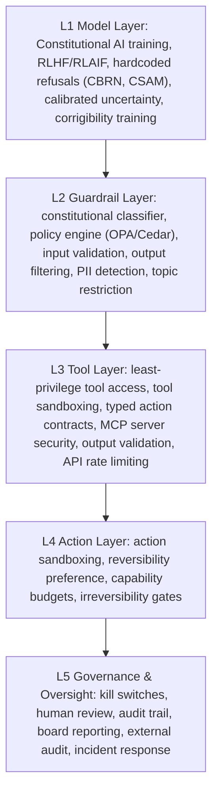
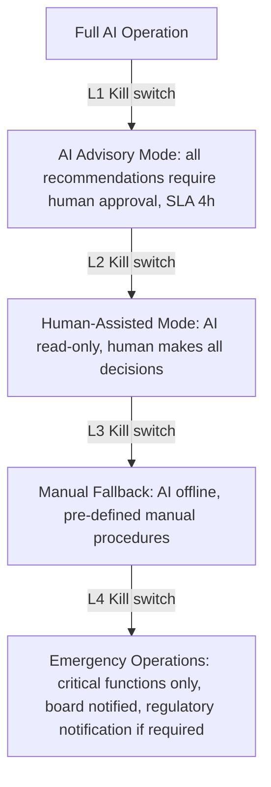

**Audience:** AI safety engineers, principal AI architects, CISOs, Chief AI Officers, AI governance leads. **Purpose:** Define a comprehensive AI safety engineering framework — from responsible scaling policies and frontier safety through the 5-layer safety stack, kill switch architecture, and safe degradation design.

## Frontier AI Safety

Responsible Scaling Policies (RSPs) commit AI labs to deploy only models meeting defined safety evaluations at each capability level, operationalizing "don't build and deploy AI systems more dangerous than you know how to make safe." Anthropic's AI Safety Level (ASL) framework runs four thresholds: ASL-1 (clearly safe, no uplift to catastrophic harm, standard safety training); ASL-2 (potential uplift for serious harm — the current Claude family — responsible use policies, CBRN monitoring, abuse detection); ASL-3 (potential uplift for mass-casualty attacks — enhanced containment, restricted deployment, mandatory safety evaluations before training or deployment); ASL-4 (approaching transformative capability — Anthropic won't train or deploy until ASL-4 safeguards are defined). Google DeepMind's Frontier Safety Framework (2024) evaluates four safety levels (SL1-SL4) against three properties: corrigibility (defers to humans), honesty (no deception), and non-harm (avoids catastrophic actions). OpenAI's Safety Preparedness Framework (2023) sets risk thresholds across cybersecurity, CBRN, persuasion, and model autonomy, each with low/medium/high/critical bands triggering deployment restrictions.

Before deploying frontier models, labs run red-team dangerous-capability evaluations: CBRN uplift (meaningful uplift to WMD creation, restricted at any significant uplift above public sources); cyberoffense (autonomous cyberweapon development, restricted above current tool capability); persuasion (convincing influence operations at scale, restricted once indistinguishable from human campaigns); and autonomous replication (acquiring resources or resisting shutdown, restricted at any demonstrated capability). Enterprise implication: request vendor dangerous-capability evaluation results before adopting any frontier model, and prefer vendors with published RSPs and independent audit (UK AISI, US AISI).

## Enterprise AI Safety Levels

Four levels scale safeguards to risk: SL1 Minimal Risk (narrow task, bounded outputs, no autonomous action, no sensitive data/external system access — e.g. an FAQ chatbot or summarizer — basic I/O filtering and standard monitoring); SL2 Managed Risk (broader scope, limited tool use, internal data access, some autonomous decisions — e.g. internal search, code review, report generation — constitutional alignment, fairness testing, kill switch); SL3 Elevated Risk (significant autonomy, external systems, consequential decisions, multi-step agents — e.g. customer-facing agents, loan underwriting, clinical support — mandatory HITL for key decisions, formal AI Impact Assessment, ARB approval, enhanced monitoring, quarterly audits); SL4 Critical Risk (high autonomy, critical infrastructure, irreversible actions, major legal/safety impact — e.g. air traffic AI, nuclear monitoring, financial market AI — independent external audit, government oversight, mandatory sovereign infrastructure, sub-1-minute kill switch).

| Requirement | SL1 | SL2 | SL3 | SL4 |
| --- | --- | --- | --- | --- |
| AI Impact Assessment | Not required | Standard | Full | Extended + external |
| ARB approval | Not required | RAI Champion | RAIO Head | AI Gov Council |
| Kill switch SLA | Not required | < 5 min | < 2 min | < 1 min |
| Fairness evaluation | Spot check | Required | Continuous | Continuous + audit |
| Sovereign infra | Not required | Not required | Preferred | Mandatory |
| Audit frequency | Annual | Bi-annual | Quarterly | Monthly |

## The 5-Layer AI Safety Stack

*Each layer compensates for failures below it: if the model layer is jailbroken, guardrails catch the output; if guardrails are bypassed, tool sandboxing limits damage; if a tool's supply chain is compromised, action sandboxing bounds blast radius; if approval is bypassed under pressure, the audit trail detects it and triggers incident response; if the kill switch itself fails, cryptographic audit trail, external audit, and regulatory reporting remain as the final backstop.*

## Kill Switch Architecture

Scope escalates in four levels: Level 1, task-level pause (any authorized engineer, under 30 seconds) — pauses a specific agent task mid-execution; Level 2, agent-level pause (on-call engineer, under 2 minutes) — pauses all tasks for a specific agent instance; Level 3, system-level pause (on-call engineer plus system owner, under 5 minutes) — pauses all agents in a system or business unit; Level 4, enterprise-wide shutdown (CISO or CAIO plus on-call engineer, dual authorization, under 10 minutes) — pauses all AI agents enterprise-wide.

Design requirements span four dimensions: reachability (every agent reachable without vendor involvement, working even if the AI system itself is compromised, via multiple independent paths — network, control plane, power); state handling (in-progress transactions rolled back or completed safely, audit log continues through shutdown, human handover information preserved); testing (quarterly, unannounced drills to be valid, documented results with SLA misses actioned, cross-team participation across Ops/Engineering/Compliance); and access control (documented invocation authority per level, MFA for Levels 3-4, dual authorization for Level 4, full audit log of every invocation).

*The graceful degradation ladder: each kill switch level steps the system down to progressively more human-controlled, less-automated operation rather than an all-or-nothing stop.*

## Autonomy Throttling

A dynamic reduction of agent autonomy based on risk signals, analogous to a software circuit breaker, running Normal to Monitored (enhanced logging plus spot-checks) to Restricted (autonomy reduced one tier) to Supervised (every action human-approved) to Paused. Throttling triggers: a constitutional violation rate above 0.5% moves Normal to Monitored; above 2% moves Monitored to Restricted; a security alert (prompt injection) moves Normal directly to Supervised; a confirmed security incident moves directly to Paused; a fairness threshold breach moves to Monitored plus triggers a bias investigation.

## Architect's Checklist

- [ ] **SF1** — Each AI system assigned Safety Level (SL1-SL4) in model registry
- [ ] **SF2** — All 5 safety layers operational for SL3+ systems
- [ ] **SF3** — Kill switch tested quarterly for all scope levels; SLA compliance documented
- [ ] **SF4** — Dangerous capability evaluation by qualified red team before major model updates
- [ ] **SF5** — Autonomy throttling state machine implemented for SL3+ agents
- [ ] **SF6** — Capability registry maintained; all capabilities default-off; audited quarterly
- [ ] **SF7** — Graceful degradation playbook documented, tested, accessible without AI system access
- [ ] **SF8** — Vendor RSP reviewed and accepted before adopting any frontier model
- [ ] **SF9** — Constitutional classifier calibrated (< 0.5% false positive rate)

## Related

- [Sovereign Constitutional AI Part 1: AI Alignment & Control](01-ai-alignment-control.md)
- [Sovereign Constitutional AI Part 6: Constitutional Agent Architecture](06-constitutional-agent-architecture.md)
- [Sovereign Constitutional AI Part 2: AI Assurance & Audit Architecture](02-ai-assurance-audit-architecture.md)
