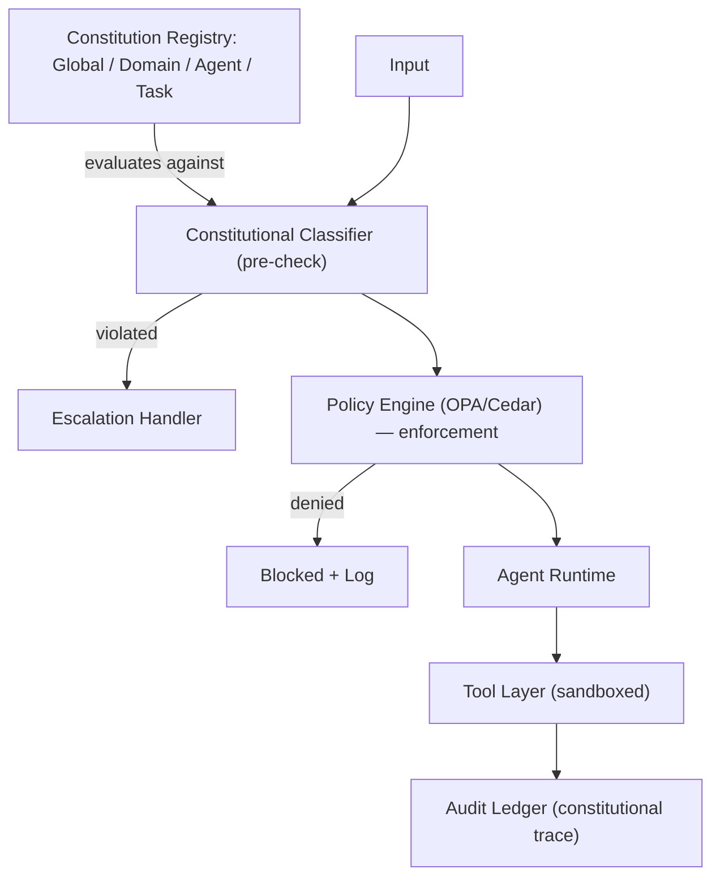
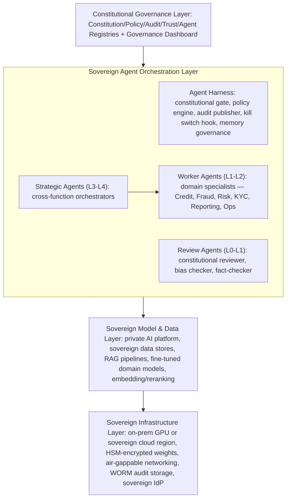

**Audience:** Principal AI architects, AI safety engineers, AI governance leads, distinguished architects. **Purpose:** Design constitutional agents governed by constitution, policy, regulatory, and business rules — including the agent governance fabric (5 registries), the L0-L5 autonomy taxonomy, and a sovereign agent ecosystem blueprint.

## Constitutional Agents

A constitutional agent operates under an explicit, versioned constitution (a documented set of behavioral principles); has that constitution enforced at runtime as executable policy constraints, not just training guidance; generates constitutional traceability linking every consequential action to the principles evaluated; supports governance — the constitution can be inspected, updated, and audited by authorized stakeholders; and escalates constitutional conflicts rather than blindly complying when an instruction conflicts with it.


*Every input passes a constitutional pre-check before reaching the policy engine and agent runtime; violations either escalate to a human or block outright, and every path terminates in the audit ledger.*

Four rule layers govern constitutional agents, in descending order of authority: constitutional rules (highest authority, sourced from the ratified AI constitution — principles-based, stable, human-readable, e.g. "never expose PII" — enforced by the constitutional classifier plus policy engine, overridable only in emergency with board approval); policy rules (sourced from policy-as-code/OPA/Cedar — executable and more granular, e.g. "block API calls to non-approved domains" — enforced in real time, fail-closed, overridable by higher-tier policy with approval); regulatory rules (sourced from legal obligation — EU AI Act, GDPR, SR 11-7 — jurisdiction-specific, e.g. "log all credit decisions with SHAP values" — enforced via compliance monitoring and audit, never overridable); and business rules (sourced from domain-specific business logic — context-specific and frequently changing, e.g. "route queries over $10K to a relationship manager" — enforced via a business rule engine or agent instructions, overridable by an authorized product owner).

## L0-L5 Agent Autonomy Taxonomy

The L0-L5 taxonomy gives a standardized language for describing, governing, and regulating agent autonomy, mapped to capability, governance requirement, and risk tier. L0 Advisory: the AI generates analysis and recommendations while humans make all decisions and take all actions (e.g. a financial advisor dashboard) — SL1/SL2 governance, RAI Champion approval, constitution recommended but not runtime-enforced. L1 Assisted: the AI prepares actions for human review and execution (e.g. drafting a loan decision for human sign-off) — SL2, ARB approval, model card required, runtime enforcement for output quality. L2 Semi-Autonomous: the AI executes routine decisions independently within bounds and escalates edge cases (e.g. processing routine insurance claims) — SL3, RAIO Head approval, AI Impact Assessment, full runtime constitutional enforcement. L3 Autonomous: the AI executes full task cycles without human checkpoints while humans monitor outcomes and retain override (e.g. an autonomous procurement agent) — SL3/SL4, AI Governance Council approval, quarterly audit, full enforcement plus constitutional traceability. L4 Supervised Autonomous: high autonomy under active real-time human supervision (e.g. AI-assisted air traffic management) — SL4, board-level approval, external audit, sovereign infrastructure, continuous compliance plus external audit. L5 Mission Autonomous: full mission planning and execution with only outcome-level human oversight (e.g. an autonomous scientific research agent) — SL4 plus government oversight and international frameworks, formal constitutional certification required; not currently deployed in regulated enterprise contexts as of 2026.

| Requirement | L0 | L1 | L2 | L3 | L4 | L5 |
| --- | --- | --- | --- | --- | --- | --- |
| Constitution | Optional | Recommended | Required | Required | Required | Certified |
| Approval level | RAI Champion | RAI Champion | RAIO Head | AI Gov Council | Board | Govt + Board |
| Kill switch SLA | Not required | 5 min | 2 min | 1 min | 30 sec | Real-time |
| Audit trail | Recommended | Required | Required | Required | Required | Certified |
| Human oversight | All decisions | All decisions | Exception-based | Outcome monitoring | Real-time | Mission outcome |
| Sovereign infra | Not required | Not required | Optional | Preferred | Required | Required |
| External audit | Not required | Not required | Annual | Quarterly | Monthly | Continuous |

Selecting an autonomy level for a new agent follows a decision framework, defaulting to L1 and raising the ceiling only as production performance validates safety and alignment: if errors can't be easily detected and reversed, cap at L2 until detection/reversal is confirmed; if failures carry direct physical or financial consequences above a threshold, cap at L3 with a mandatory human oversight gate; if the action space affects non-consenting third parties, cap at L2 with mandatory human review of third-party-affecting actions; if the regulatory framework requires human decision-making, cap at L1 (advisory only); if the task falls outside the model's validated performance envelope, cap at L1 until validated; if the agent's actions can't be fully explained after the fact, cap at L2 until explainability is achieved.

## Agent Governance Fabric

The fabric rests on five registries, the source of truth for all governance-relevant agent information: the Agent Registry (agent ID, name, version, model reference, constitution reference, autonomy level, tool permissions, owner, safety level, kill switch URI); the Constitution Registry (constitution ID, version, sections, principles, signer, ratification date, amendment log); the Policy Registry (policy ID, name, Rego/Cedar bundle, constitution reference, version, effective date, git commit hash); the Trust Registry (principal ID and type, trust score, permissions, expiry, issuer, SPIFFE ID); and the Audit Registry (decision ID, agent ID, timestamp, constitutional trace, policy decisions, outcome, chained hash).

A representative agent registry entry:

```yaml
agent:
  id: "AGT-LOAN-UNDERWRITER-001"
  name: "Loan Underwriting Agent"
  version: "2.3.1"
  model: { id: "anthropic/claude-fable-5", deployment: "private-endpoint-eu-west", sovereign: true }
  constitution: { id: "BANK-CONST-001", version: "1.2.0", enforced_at_runtime: true }
  autonomy_level: L2
  safety_level: SL3
  tool_permissions:
    - { tool: "credit_bureau_query", scope: "read", rate_limit: "100/hour" }
    - { tool: "core_banking_read", scope: "read", rate_limit: "500/hour" }
  owner: { team: "Retail Lending", lead: "Jane Smith", accountability: "Product Owner" }
  kill_switch: { uri: "https://ops.internal/agents/AGT-LOAN-001/kill", sla_minutes: 2, on_call: "ops-pagerduty-P1" }
  audit: { ledger_endpoint: "https://audit.internal/ledger/AGT-LOAN-001", retention_years: 7 }
  approved_by: "RAIO Head"
  approval_date: "2026-06-15"
  next_review: "2026-09-15"
```

## Multi-Agent Constitutional Systems

In multi-agent pipelines, constitutions are inherited and composed down the hierarchy: an L3 Orchestrator Agent carries Global plus Domain plus Orchestrator-specific constitution scoped to full pipeline coordination; L2 Worker Agents each carry Global plus Domain plus their own specific constitution scoped to their function (e.g. credit analysis, fraud detection); an L1 Reviewer Agent carries Global plus Domain plus Reviewer-specific constitution scoped to decision validation, with the rule that any flagged constitutional violation escalates to a human. Inter-agent trust rules: an agent may never grant another agent permissions it doesn't itself hold; constitutional constraints from parent agents propagate to children; constitutional violations in any agent propagate upward as escalation triggers; and orchestrators cannot override a worker agent's constitutional prohibitions.

When Agent A invokes Agent B, authorization follows a fixed protocol: A presents its identity (SPIFFE ID plus JWT); B's policy engine checks whether A is authorized to invoke B, whether A's requested action falls within B's permitted scope, and whether the action complies with both agents' constitutions; if authorized, the action proceeds and an audit log entry is created; if not, the action is blocked and a constitutional flag is raised; every inter-agent invocation is logged in the audit registry regardless of outcome.

## Sovereign Agent Ecosystem Blueprint


*Governance sits atop the stack and applies uniformly down through orchestration, model/data, and infrastructure — strategic agents plan across worker agents, and review agents provide a constitutional check before output leaves the system.*

## Future: Constitutional Agent Operating Systems (2027+)

Emerging research and product development moves toward governance-first agent operating systems, where every action is governed at the OS level via agent charters (startup configuration specifying constitution, autonomy level, tool permissions), fiscal controls (token budgets, API cost limits, resource quotas enforced at runtime), trust scores (dynamic scores based on behavior history), and a constitutional kernel (OS-level constitutional enforcement before any action executes). Anthropic (Claude Agent SDK), Microsoft (AutoGen), and emerging AI OS startups are building toward this model — enterprise architects should design governance fabrics now that are compatible with it.

## Related

- [Sovereign Constitutional AI Part 7: Constitutional AI Engineering](07-constitutional-ai-engineering.md)
- [Sovereign Constitutional AI Part 5: AI Safety Framework](05-ai-safety-framework.md)
- [Sovereign Constitutional AI Part 9: Policy-as-Code Framework](09-policy-as-code-framework.md)
