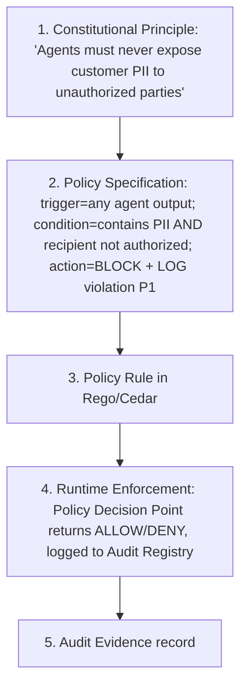
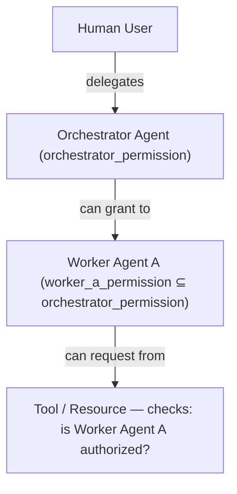
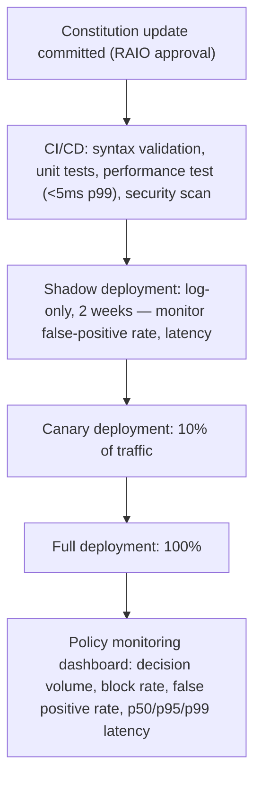

**Audience:** Principal AI architects, security architects, AI governance leads, platform engineers. **Purpose:** Design the complete policy-as-code framework for AI governance — OPA/Rego, Cedar, OpenFGA, and PBAC — including the constitution-to-code pipeline and the Responsible AI Control Library.

## Policy Engine Comparison

| Engine | Policy language | Paradigm | Strengths | AI governance use case |
| --- | --- | --- | --- | --- |
| OPA (Open Policy Agent) | Rego | General-purpose; unified policy | Kubernetes-native; broad ecosystem; HTTP API | Authorization decisions; input/output filtering; compliance checks |
| Cedar | Cedar | Fine-grained; entity-based; fast | AWS-native; formally verified; easy reasoning | Agent capability controls; resource access; action authorization |
| OpenFGA | JSON tuples | Relationship-based (Zanzibar) | Google-inspired; strong for social graphs and delegated access | Agent delegation chains; multi-principal access; trust hierarchies |
| Casbin | Model + policy files | RBAC/ABAC/PBAC | Simple to deploy; multi-language SDK | Basic RBAC for agent tool access |

Recommended combination: Cedar for agent capability authorization (what agents can do and to what resources), OPA for complex multi-condition/cross-system compliance checks, and OpenFGA for delegation chains (orchestrator to worker to tool authorization).

## Constitution-to-Code Pipeline

The pipeline transforms a high-level constitutional principle into executable runtime policy:



```rego
package ai.constitutional

deny[reason] {
  input.action == "output"
  pii_detected := detect_pii(input.content)
  pii_detected != []
  not authorized_for_pii(input.recipient_id)
  reason := sprintf("Constitutional violation P1: PII (%v) to unauthorized recipient",
                    [pii_detected])
}
```

```json
{
  "decision_id": "DEC-2026-07-06-001",
  "constitutional_principle": "P1",
  "trigger": "pii_in_output",
  "action": "BLOCKED",
  "evidence": {"pii_types": ["email", "phone"], "recipient_auth": false}
}
```

Banking constitution (BANK-CONST-001) principles translate directly into Rego and Cedar:

```rego
package bank.constitution

# BP1: Never approve credit without fair lending checks
deny[reason] {
  input.action == "credit_approval"
  not fair_lending_check_complete(input.application_id)
  reason := "BP1: Fair lending check not completed"
}

# BP2: Never recommend unsuitable products (MiFID II)
deny[reason] {
  input.action == "investment_recommendation"
  suitability_score := calculate_suitability(input.product_id, input.customer_profile_id)
  suitability_score < data.thresholds.suitability_minimum
  reason := sprintf("BP2: Product suitability score %.2f below threshold %.2f",
                    [suitability_score, data.thresholds.suitability_minimum])
}

# BP5: Never make final adverse credit decision without human review
deny[reason] {
  input.action == "adverse_credit_decision"
  input.final == true
  not human_review_completed(input.application_id)
  reason := "BP5: Final adverse decision requires human review (GDPR Art. 22)"
}
```

```cedar
// Cedar: Agent capability control for banking
permit(
  principal == Agent::"loan-underwriting-agent",
  action == Action::"query_credit_bureau",
  resource == CreditBureau::"equifax-eu"
)
when {
  principal.autonomy_level <= 2 &&
  resource.region == principal.approved_regions &&
  context.purpose == "credit_assessment"
};

forbid(
  principal is Agent,
  action == Action::"send_external_email",
  resource is ExternalSystem
)
unless {
  principal.email_authorized == true &&
  context.recipient in principal.approved_recipients
};
```

Healthcare (HEALTH-CONST-001) and government (GOV-CONST-001) constitutions follow the identical pattern:

```rego
package health.constitution

# HP1: Never recommend treatment without validated evidence base
deny[reason] {
  input.action == "treatment_recommendation"
  evidence_level := get_evidence_level(input.treatment_id, input.condition_id)
  evidence_level < data.thresholds.minimum_evidence_level
  reason := sprintf("HP1: Treatment evidence level %d below minimum %d",
                    [evidence_level, data.thresholds.minimum_evidence_level])
}

# HP4: Never train on patient data without de-identification + IRB
deny[reason] {
  input.action == "model_training"
  not input.dataset.deidentified
  reason := "HP4: Patient data must be de-identified before use in training"
}

deny[reason] {
  input.action == "model_training"
  input.dataset.contains_patient_data
  not irb_approved(input.dataset.id)
  reason := "HP4: IRB approval required for patient data use in training"
}
```

```rego
package government.constitution

# GP1: No final decisions on citizen rights without human review
deny[reason] {
  input.action == "benefit_determination"
  input.final == true
  not human_review_completed(input.case_id)
  reason := "GP1: Citizen rights decisions require human review (EU AI Act Art. 14)"
}

# GP5: Citizen data must remain on sovereign infrastructure
deny[reason] {
  input.action == "data_transfer"
  input.data_classification == "citizen_data"
  not is_sovereign_destination(input.destination)
  reason := "GP5: Citizen data may only be transferred to sovereign infrastructure"
}
```

## OpenFGA for Agent Delegation Chains

OpenFGA models the relationship-based delegation chains governing multi-agent authorization:



```
user:orchestrator-agent#can_delegate → worker-agent-a
user:worker-agent-a#can_access → tool:credit-bureau-api
user:human-user#can_authorize → orchestrator-agent
```

```json
{
  "type_definitions": [
    {
      "type": "Agent",
      "relations": {
        "orchestrator": {"this": {}},
        "worker": {"this": {}},
        "can_delegate": {"union": {"child": [{"this": {}}, {"computedUserset": {"relation": "orchestrator"}}]}}
      }
    },
    {
      "type": "Tool",
      "relations": {
        "can_access": {"union": {"child": [
          {"this": {}},
          {"tupleToUserset": {"tupleset": {"relation": "authorized_agent"}, "computedUserset": {"relation": "can_delegate"}}}
        ]}}
      }
    }
  ]
}
```

## PBAC — Policy-Based Access Control for AI

PBAC goes beyond RBAC/ABAC to express complex, dynamic conditions as first-class policies, enabling context-sensitive authorization (the same agent granted a different autonomy level by time of day or market conditions), constitutional conditions (authorization contingent on constitutional compliance status), and risk-adaptive authorization (higher-risk actions require a higher-trust principal or lower-risk context):

```yaml
policy:
  id: "POL-AGENT-CREDIT-001"
  name: "Credit Decision Authorization"
  statements:
    - effect: ALLOW
      principal: { type: Agent, attribute: autonomy_level, operator: lte, value: 2 }
      action: "credit_decision"
      resource: { type: LoanApplication, attribute: amount, operator: lte, value: 50000 }
      conditions:
        - constitutional_compliance_rate: ">= 0.99"
        - fair_lending_check: "COMPLETED"
        - market_hours: "true"
    - effect: ALLOW
      principal: { type: Agent, attribute: autonomy_level, operator: lte, value: 1 }
      action: "credit_decision"
      resource: { type: LoanApplication, attribute: amount, operator: gt, value: 50000 }
      conditions:
        - human_reviewer: "ASSIGNED"
        - dual_authorization: "REQUIRED"
```

## Responsible AI Control Library

A catalogued set of reusable policy controls — the control reference for building constitutional policy stacks:

| Control ID | Category | Name | Policy engine | Enforcement |
| --- | --- | --- | --- | --- |
| RAI-001 | Privacy | PII detection and blocking | OPA | Block output if PII detected for unauthorized recipient |
| RAI-002 | Privacy | Data residency enforcement | Cedar | Block data transfer to non-sovereign destination |
| RAI-003 | Fairness | Demographic parity gate | OPA | Block batch decision if demographic parity gap > threshold |
| RAI-004 | Transparency | AI identity disclosure | OPA | Require AI disclosure in all user-facing outputs |
| RAI-005 | Safety | Irreversibility gate | Cedar | Require human approval for irreversible actions |
| RAI-006 | Safety | Kill switch enforcement | System | All agents reachable and stoppable |
| RAI-007 | Accountability | Decision logging | System | All decisions logged to audit registry |
| RAI-008 | Accountability | Human escalation | OPA | Block final decisions on protected categories without human review |
| RAI-009 | Autonomy | Autonomy level enforcement | Cedar | Deny actions outside declared autonomy level |
| RAI-010 | Constitutional | Constitutional classifier | Model | Block outputs violating constitutional principles |
| RAI-011 | Security | Prompt injection detection | System | Block suspected injection attempts |
| RAI-012 | Sovereignty | Sovereign infra enforcement | Cedar | All Tier 1 workloads on sovereign infrastructure only |
| RAI-013 | Regulatory | GDPR Art. 22 gate | OPA | Block fully automated decisions on protected individuals without opt-out |
| RAI-014 | Regulatory | SR 11-7 documentation | System | Generate model documentation on deployment |
| RAI-015 | Constitutional | Constitutional traceability | System | Log constitutional evaluation for every consequential decision |

A representative control implementation, RAI-003 (Demographic Parity Gate):

```rego
package rai.fairness.demographic_parity
import future.keywords.if

threshold := data.rai_controls.RAI003.threshold  # default: 0.05

deny[reason] if {
  input.action == "batch_credit_decision"
  gap := abs(input.metrics.approval_rate_group_a - input.metrics.approval_rate_group_b)
  gap > threshold
  reason := sprintf("RAI-003: Demographic parity gap %.3f exceeds threshold %.3f. Block batch.",
                    [gap, threshold])
}

abs(x) := x if x >= 0
abs(x) := -x if x < 0
```

## Policy Deployment Architecture



## Related

- [Sovereign Constitutional AI Part 7: Constitutional AI Engineering](07-constitutional-ai-engineering.md)
- [Sovereign Constitutional AI Part 6: Constitutional Agent Architecture](06-constitutional-agent-architecture.md)
- [Sovereign Constitutional AI Part 3: AI Governance Operating Model](03-ai-governance-operating-model.md)
