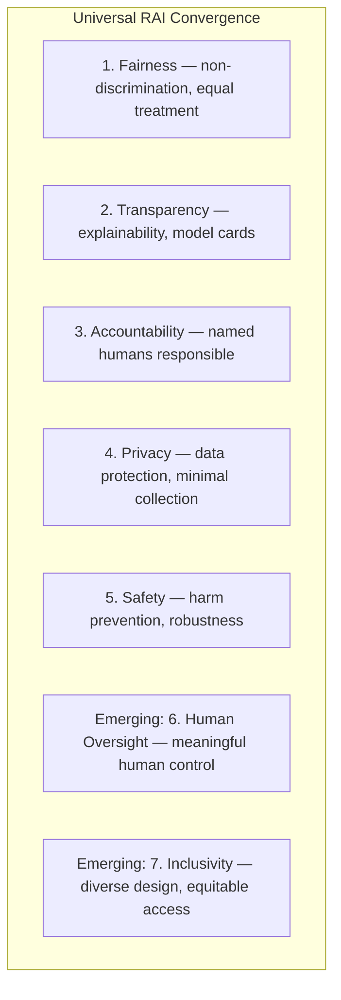
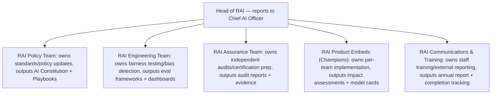
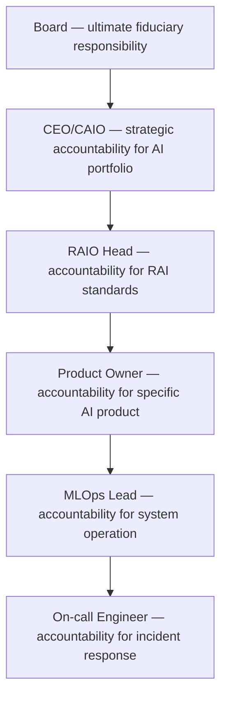

**Audience:** AI governance leads, Chief AI Officers, RAI officers, enterprise architects, board advisors. **Purpose:** Compare global RAI frameworks, define core RAI pillars with operational metrics, and design the Responsible AI Office operating model. The EU AI Act Digital Omnibus update (Dec 2027 phase-in, Aug 2028 full compliance for high-risk systems) has made RAI operational frameworks a legal requirement in the EU, not merely good practice; the NIST AI RMF 1.0 and ISO 42001:2023 provide the implementation methodology.

## Global Responsible AI Landscape

Between 2018 and 2026, over 160 national and organizational AI ethics frameworks were published. The challenge for enterprise architects is convergence — identifying common principles that let a single operating model satisfy multiple frameworks at once. The good news: despite surface differences, all major frameworks converge on five to seven core principles.

| Dimension | Microsoft RAI | Google PAIR/RAI | IBM Trustworthy AI | OECD AI Principles | UNESCO AI Ethics | NIST AI RMF |
| --- | --- | --- | --- | --- | --- | --- |
| Published | 2018 (rev. 2022) | 2019 (rev. 2023) | 2018 (rev. 2021) | 2019 | 2021 | 2023 |
| Primary audience | Enterprise customers | Developers & society | Enterprise clients | Governments | All stakeholders | US federal + enterprise |
| Fairness | Fairlearn, InterpretML | Model Cards | OpenScale/Watson | "Inclusive growth" | "Non-discrimination" | MEASURE function |
| Transparency | "Transparency" pillar | Model Cards | Explainability | "Transparency and explainability" | "Transparency" | GOVERN function |
| Accountability | "Accountability" pillar | Yes | AI FactSheets | "Accountability" | "Responsibility" | GOVERN function |
| Enforceability | Voluntary | Voluntary | Voluntary | Voluntary (soft law) | Voluntary | Voluntary (US federal reference) |

The OECD AI Principles (2019, updated 2024) are the most widely adopted intergovernmental reference, endorsed by 46+ countries including all G20 members, across five values: inclusive growth/sustainable development/well-being; human-centred values and fairness; transparency and explainability; robustness/security/safety; and accountability — the 2024 update added specific guidance on general-purpose AI models and agentic systems. UNESCO's AI Ethics Recommendation (2021, adopted by all 193 member states) is the first global normative AI ethics framework, adding proportionality and do-no-harm (no surveillance, political manipulation, or systematic targeting of vulnerable groups), physical-world safety for autonomous systems, a stronger individual-rights emphasis on privacy than OECD, mandatory multi-stakeholder governance, and international solidarity (preventing AI from widening gaps between high- and low-income countries).

*Build the RAI operating model on these universal pillars; mapping to any specific vendor or national framework then becomes a compliance overlay, not a restructuring.*

## Vendor Framework Comparison

Microsoft's RAI framework (2022) defines six principles with strong tooling: Fairness (Fairlearn, InterpretML, Azure AI Fairness Assessment), Reliability and Safety (Azure Content Safety, Safety Evaluations), Privacy and Security (Presidio, Azure Confidential Computing), Inclusiveness (Cognitive Services accessibility features), Transparency (Model Cards, Azure AI Transparency Notes), and Accountability (Responsible AI Dashboard, Impact Assessments). Its governance runs a Responsible AI Council (senior policy), an Office of Responsible AI (policy development/enforcement), an Aether Committee (AI/Ethics/Effects advisory body), and embedded RAI Champs per product team — a distributed-plus-central hybrid that is the most effective model at scale.

Google's AI Principles (2018, updated 2023) commit to building AI that is socially beneficial, avoids unfair bias, is safety-tested, accountable, privacy-respecting, and scientifically excellent — and explicitly commit to NOT building weapons, surveillance technology violating international norms, or anything contravening international law. Google PAIR (People + AI Research) contributes the People + AI Guidebook (UX guidance), Model Cards, FACETS (dataset visualization), and the What-If Tool (interactive model analysis).

IBM's Trustworthy AI framework emphasizes five pillars with dedicated open-source tooling: Explainability (AI Explainability 360), Fairness (AI Fairness 360), Robustness (Adversarial Robustness Toolbox), Transparency (IBM FactSheets), and Privacy (a differential privacy library). IBM's AI FactSheets predate Model Cards and represent an enterprise-grade artifact — comprehensive documentation of purpose, performance, limitations, governance, and maintenance aimed at enterprise procurement and regulatory review.

## Responsible AI Operating Model

The Responsible AI Office (RAIO) operationalizes RAI principles, sitting between the AI Governance Council (policy) and AI Platform Teams (implementation).

RAI integrates at every lifecycle stage: Idea/Incubation gets a preliminary AI Impact Assessment (RAI Policy Team); Design gets fairness requirements and bias risk identification (RAI Champion plus ML team); Data gets a dataset audit for bias/representation/consent (Data Architect plus RAI Engineering); Training gets bias metrics monitoring (MLOps plus RAI Engineering); Evaluation gets a full fairness audit, adversarial testing, and model card draft (RAI Assurance plus ML team); Pre-deployment gets the final AI Impact Assessment and RAIO sign-off (Head of RAI); Production gets ongoing bias monitoring and drift detection (RAI Engineering plus MLOps); Retirement gets a responsible retirement assessment (RAI Policy plus Data Architect).

**Fairness** means AI must not produce systematically different outcomes across demographic groups without justification. Key metrics: Demographic Parity (`|P(Y=1|A=0) - P(Y=1|A=1)|`, acceptable under 0.05 for most contexts, 0 for legal decisions); Equalized Odds (`|TPR_A0-TPR_A1| + |FPR_A0-FPR_A1|`, under 0.1); Individual Fairness (similar individuals get similar outputs, a context-dependent similarity metric); Counterfactual Fairness (same outcome if the protected attribute changed, requiring a causal model) — tooled via AI Fairness 360, Fairlearn, the What-If Tool, and SHAP attribution.

**Transparency** operates at four levels: model-level for regulators/auditors (model card, AI FactSheet); decision-level for individual users/courts (LIME/SHAP explanation); system-level for the board/public (AI system register, annual RAI report); and constitutional-level for governance bodies (the published AI constitution).

**Accountability** means named humans are responsible for AI decisions and outcomes — never delegable to the AI system itself.

**Privacy** requires collecting, processing, and retaining only data necessary for the stated purpose, using techniques like Federated Learning (train on distributed data without centralizing it — healthcare, cross-org learning), Differential Privacy (calibrated noise protecting individual records — analytics, training queries), Homomorphic Encryption (compute on encrypted data — cloud inference without exposure), Secure Multi-Party Computation (joint computation without sharing — cross-bank fraud detection), and Synthetic Data (statistically equivalent datasets when real data is sensitive). **Safety** requires AI not cause harm to users, operators, third parties, or society, and remain robust to adversarial attack — see [AI Safety Framework](05-ai-safety-framework.md) for the full engineering approach.

Governance cadence: a weekly RAI standup (Engineering plus MLOps — monitoring alerts, bias drift, open incidents); a bi-weekly Model Review Board (Assurance plus Product Owners — pre-deployment reviews, model card sign-off); a monthly RAI Policy Review (RAIO plus Legal plus Compliance — policy updates, regulatory changes, exceptions); a quarterly AI Governance Council session (C-suite, Board Risk Committee rep — strategic posture, major incidents, roadmap); and an Annual RAI Report published externally.

## How Leading Organizations Implement RAI

Microsoft's Office of Responsible AI operates six sensitivity use cases requiring a mandatory Responsible AI Impact Assessment (RAIA) before deployment — any product using AI for consequential decisions in health, finance, legal, safety, or identity must pass RAIA review, enforced at product launch gating. Google's AI Responsibility team reviews high-risk projects through a Sensitive Use Review process, DeepMind publishes Frontier Safety Frameworks publicly, and Google Cloud publishes annual AI Principles Progress Updates. IBM's AI Ethics Board reviews high-stakes deployments, has open-sourced its RAI toolkits (AIF360, AIX360, ART), and enterprise clients use Watson OpenScale for production monitoring. In financial services, EU banks under the EU AI Act are building mandatory AI registers, RAI Impact Assessment processes, and human oversight mechanisms for High-Risk AI, with the European Banking Authority publishing RAI implementation guidelines for credit risk models.

## Architect's Checklist

- [ ] **R1** — Organization has a named Head of RAI with board-level access
- [ ] **R2** — All AI products have a designated RAI Champion embedded in the team
- [ ] **R3** — Fairness metrics defined, baselined, and monitored in production for all High-Risk AI
- [ ] **R4** — Model Cards published for all external-facing AI systems
- [ ] **R5** — AI Impact Assessment completed before deployment for any consequential AI
- [ ] **R6** — Bias testing included in CI/CD pipeline (automated; blocks deployment if threshold exceeded)
- [ ] **R7** — Privacy-preserving technique selected and documented for all AI using personal data
- [ ] **R8** — Accountability chain documented from board to on-call engineer for every AI system
- [ ] **R9** — Annual RAI external report published
- [ ] **R10** — RAI training completed by all staff working on AI systems (tracked and audited)

## Related

- [Sovereign Constitutional AI Part 3: AI Governance Operating Model](03-ai-governance-operating-model.md)
- [Sovereign Constitutional AI Part 5: AI Safety Framework](05-ai-safety-framework.md)
- [Sovereign Constitutional AI Part 2: AI Assurance & Audit Architecture](02-ai-assurance-audit-architecture.md)
