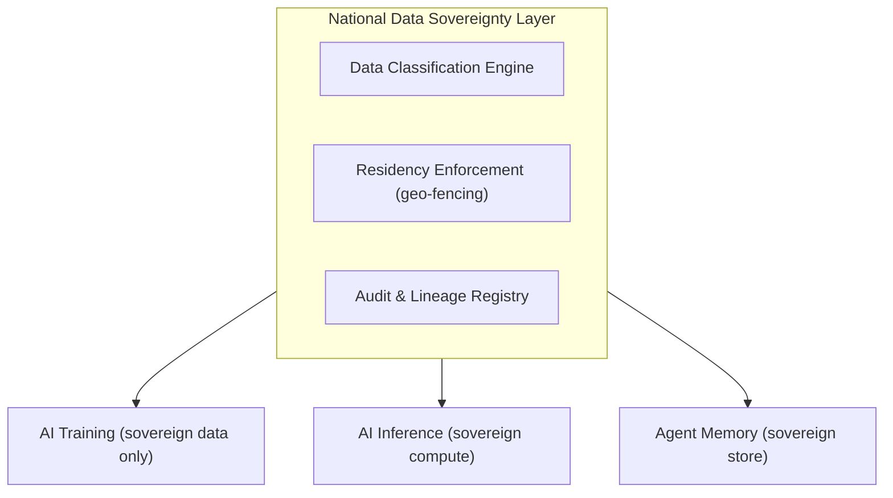
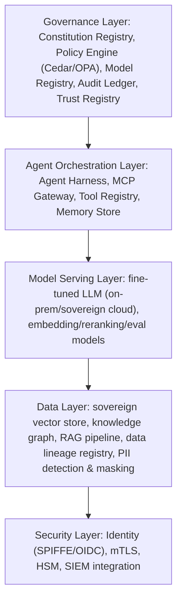

**Audience:** Chief AI Officers, enterprise architects, policy makers, CISOs, national AI strategy teams. **Purpose:** Define Sovereign AI across national, enterprise, and infrastructure dimensions; establish reference architectures and implementation patterns. This part covers what sovereign AI is, the six national sovereignty dimensions, and enterprise sovereignty; [Part 2](parts/11-sovereign-ai-foundations-part2.md) covers the reference architecture, maturity model, and national case studies.

## What Is Sovereign AI?

Sovereign AI is the condition where a nation, organization, or ecosystem exercises meaningful control over the AI systems affecting it — the data those systems consume, the compute they run on, the models they deploy, the infrastructure hosting them, the talent building them, and the governance structures directing them. Sovereignty is a spectrum, not a binary: L1 Cloud Consumer (foreign models on foreign cloud with foreign data controls) progresses through L2 Data Sovereign (foreign models on sovereign cloud with own data controls) and L3 Infrastructure Sovereign (foreign models on own infrastructure with own data controls) to L4 Full Stack Sovereign (own data, compute, model, and governance end to end).

Three forces converged in 2025-2026 to make sovereignty urgent: geopolitical AI dependency (organizations discovered frontier model access can be suspended via export controls, sanctions, or vendor decisions, leaving several national governments with no fallback); data residency and regulatory pressure (the EU AI Act, GDPR enforcement, and equivalents in India, China, Brazil, and the UAE require AI-processed data to stay within defined jurisdictions with regulator-accessible audit trails); and strategic competitive advantage (sovereign AI capability lets nations and enterprises build proprietary models on unique datasets, a durable moat API consumption alone can't replicate).

## National Sovereignty Dimensions

**Data sovereignty** holds that data is subject to the laws and governance of the nation where it originates or resides, built on data localization (sovereign cloud regions, on-prem data centers), data governance (residency agreements, DPA contracts), data portability (open standards, portability APIs), data access rights (legal intercept, key escrow), and data deletion rights (GDPR Art. 17 plus AI system delete cascades). AI adds specific challenges: training data can leave residual patterns in a model even after deletion ("memorization"), RAG systems pull data dynamically from sources that may cross jurisdictions, and agent memory stores accumulate user data across sessions requiring maintained residency.

*Data classes (National Security, Personal, Public) and named residencies (EU, IN, AE, US, AU) gate every downstream AI system.*

**Compute sovereignty** is control over the GPUs/TPUs/NPUs and infrastructure running AI workloads. As of 2025, roughly 90% of global AI compute concentrated in three hyperscalers (AWS, Azure, GCP) and a handful of GPU manufacturers, exposing dependents to export control restrictions (US BIS Entity List, ITAR), hyperscaler pricing/availability decisions, and the compute provider's home-nation jurisdiction. Sovereign compute pathways range from national AI compute clusters (France's GENCI, India's AI supercomputers, UAE's Falcon compute — 3-7 years to full capability) and sovereign cloud regions (AWS GovCloud, Azure Government, OVHcloud, G42 — available now) to private enterprise infrastructure, edge AI compute, and strategic national chip capability (EU Chips Act, India Semiconductor Mission — 5-10 years). The key insight: compute sovereignty doesn't require owning every GPU, only a guaranteed fallback and no single point of foreign control over critical workloads.

**Model sovereignty** is the ability to train, own, fine-tune, and operate models without foreign-provider dependency, spanning a spectrum from pure API Consumer (zero model control) through fine-tuning a foreign model on own data (limited control) and training on own infrastructure with open weights, to full pre-training on sovereign data with an owned RLHF/CAI pipeline. National programs as of July 2026: the UAE's Falcon (TII, operational, Falcon 180B released), France's BLOOM/Mistral (operational EU flagship), India's IndiaAI Foundation Models (in development, BharatGPT), Saudi Arabia's ALLaM (operational), the UK's frontier-safety-focused strategic reserve approach, Singapore's SEA-LION (operational), Germany's OpenGPT-X/LEAM (research phase), and China's full domestic model stack (operational, regulatory mandate). Enterprise patterns mirror this: fine-tuning open-weight models (Llama, Mistral, Falcon) on proprietary data, RAG over sovereign knowledge bases, enterprise-specific instruction-tuning and RLHF, and on-prem inference with enterprise-controlled weight storage.

**Infrastructure sovereignty** covers compute, networking, storage, and operations subject to national or enterprise law — Gartner's 2026 definition of sovereign cloud requires isolation, residency, and access assurance so data, workloads, and operational controls stay governed exclusively by the contracting jurisdiction. Four tiers: Data Residency (data stays in-country, operated by a global hyperscaler — AWS eu-west-1, Azure Germany); Operational Sovereignty (a national entity operates foreign technology — T-Systems on Azure, Capgemini on AWS France); Technology Sovereignty (a national entity controls both operations and underlying technology — G42, OVHcloud, Cloudreach); and Full Sovereignty (national control of everything including hardware — air-gapped national data centers). Critical infrastructure (power grids, water systems, defense, financial market infrastructure) extends sovereignty requirements to air-gapped operation, HSM-based weight encryption, quantum-resistant model-signing cryptography, and OT integration without internet dependency.

**Talent sovereignty** matters because full data/compute/model/infrastructure sovereignty with foreign-talent dependency still leaves a critical vulnerability. Components: national AI curricula and university programs, researcher immigration/retention policy, an enterprise AI Center of Excellence retaining institutional knowledge, knowledge-transfer requirements in government AI contracts, and open-source contribution programs. Enterprise risks: key-person dependency in governance and operations, brain drain to frontier labs or foreign enterprises, contractor/SI dependency with no internal capability transfer, and documentation gaps blocking operational handover.

**Governance sovereignty** is the ability to make autonomous decisions about AI operation within a jurisdiction without external veto — setting your own risk thresholds independent of vendor defaults, modifying model behavior (fine-tuning, RAG, guardrails) without vendor permission, auditing at the weight level if required, shutting down systems without vendor involvement, and defining permitted use cases that may differ from vendor terms of service. The practical test: can you shut down an AI system affecting critical decisions within 15 minutes without contacting a foreign vendor? If not, there's a governance sovereignty gap.

## Enterprise Sovereignty

Enterprise Sovereign AI is the organizational equivalent of national sovereign AI — control over AI destiny at the board, operating model, and technical stack level. Enterprises build or own models rather than only consuming APIs for six reasons: proprietary data advantage (unique domain knowledge competitors can't access), data security (sensitive data can't flow to external endpoints), regulatory compliance (SEC/FDA/PRA may require model-internals access), cost at scale (60-90% cost reduction at high token volumes versus API pricing), customization (instruction-tuning and RLHF aligned to enterprise values), and governance control (enterprise policy governs behavior, not vendor terms).

*An enterprise private AI platform reference architecture: governance sits above orchestration, which drives model serving over sovereign data, with security cutting across every layer.*

Air-gapped AI operates with no external connectivity — required for classified government operations, critical national infrastructure, and some regulated financial environments. Design requirements: all model weights on HSM-backed encrypted local storage; no telemetry, usage metrics, or update requests leaving the enclave; MCP servers and tools confined to internal networks; updates delivered via physically isolated media; offline license validation and usage tracking. Operational challenges include model staleness (no access to frontier updates), a tool ecosystem that must be fully self-contained, evaluation without external benchmarks (internal evals only), and incident response without vendor support.

Regulatory AI — systems purpose-built for compliance functions like regulatory reporting, risk assessment, audit, and supervisory interaction — carries heightened sovereignty requirements because its outputs go directly to regulators, it must be explainable at the decision level (not just the model level), it may face regulatory inspection, and its failure carries direct legal and financial consequences.

## Related

- [Sovereign Constitutional AI Foundations (2 of 2)](parts/11-sovereign-ai-foundations-part2.md)
- [Sovereign Constitutional AI Part 12: Sovereign AI Roadmap & Maturity](12-sovereign-ai-roadmap-maturity.md)
- [Sovereign Constitutional AI Part 3: AI Governance Operating Model](03-ai-governance-operating-model.md)
