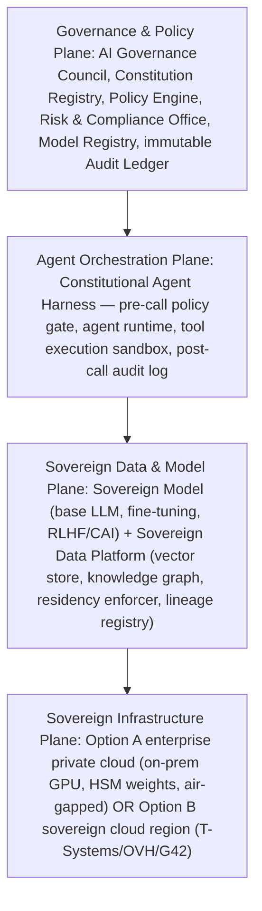

Continuing from [Part 1](../11-sovereign-ai-foundations.md) (what sovereign AI is, the six national sovereignty dimensions, and enterprise sovereignty): this part covers the sovereign AI reference architecture, AI digital twins, the sovereign AI maturity model, and how leading nations are building sovereign AI.

## Sovereign AI Reference Architecture

An enterprise-grade sovereign AI stack runs four planes. The Governance & Policy Plane holds the AI Governance Council, Constitution Registry, Policy Engine (OPA/Cedar), Risk & Compliance Office, Model Registry, and an immutable Audit Ledger. Below it, the Agent Orchestration Plane runs a Constitutional Agent Harness with a pre-call policy gate, agent runtime, sandboxed tool execution, and a post-call audit log. Below that, the Sovereign Data & Model Plane pairs a Sovereign Model component (a base LLM — open-weight or own — plus a fine-tuning pipeline and RLHF/CAI alignment) with a Sovereign Data Platform (vector store, knowledge graph, a data residency enforcer, and a lineage registry). At the base, the Sovereign Infrastructure Plane offers two options: an enterprise private cloud (on-prem GPU cluster, HSM-encrypted weights, air-gapped networking) or a sovereign cloud region (T-Systems, OVH, G42).

Reference architecture decision points trade sovereignty-maximizing choices against pragmatic alternatives: model (own pre-trained/fine-tuned open-weight versus a fine-tuned open-weight model on sovereign infrastructure); inference (on-prem GPU cluster versus a sovereign cloud region with dedicated capacity); data storage (on-prem encrypted storage versus sovereign cloud with customer-managed keys); policy engine (self-hosted OPA/Cedar versus a sovereign cloud-hosted PDP); audit ledger (on-prem WORM storage versus sovereign cloud S3-compatible WORM); and model registry (internal MLflow/DVC versus a sovereign cloud model registry).

## AI Digital Twins and Infrastructure Control

AI Digital Twins are live replicas of AI system state — model versions, data lineage, agent behavior logs, policy states — used to simulate proposed changes before production rollout, demonstrate AI system behavior to regulators, support disaster recovery and audit replay, and enable geopolitical contingency planning (failover to alternate infrastructure). Agentic Infrastructure Control, emerging from 2026 onward, has AI agents manage and optimize AI infrastructure itself — auto-scaling GPU clusters, re-routing inference traffic, updating policy bundles — creating a meta-governance requirement: agents that govern AI infrastructure must themselves be constitutionally governed.

## Sovereign AI Maturity Assessment

Five dimensions scale from Level 1 (Dependent) to Level 4 (Sovereign). Data: all flows to foreign clouds, versus residency enforced for sensitive classes, versus full residency and lineage for all AI data, versus independently audited data sovereignty. Compute: 100% foreign hyperscaler, versus sovereign cloud for regulated workloads, versus a hybrid sovereign-primary/foreign-burst model, versus full sovereign compute for critical AI. Model: API-only consumption, versus a fine-tuned foreign model on sovereign infrastructure, versus owned domain-specific models, versus full pre-training and RLHF on a sovereign stack. Infrastructure: no sovereign infrastructure, versus a sovereign cloud region, versus a private AI platform, versus air-gappable crisis-resilient infrastructure. Governance: vendor terms define limits, versus internal policy layered on vendor defaults, versus constitutional governance with audit, versus fully independent governance with kill-switch autonomy.

## How Leading Nations Are Building Sovereign AI

France and the EU combine LEAM, Mistral, and the EU AI Act into a regulatory-plus-industry strategy: mandating transparency and risk controls by law, funding sovereign model development, and building sovereign cloud through OVHcloud, T-Systems, and Capgemini partnerships with hyperscalers. The UAE's G42/Falcon (TII) program represents the most advanced emerging-market sovereign AI strategy — RLHF-aligned models, sovereign compute, and governance aligned to UAE AI Strategy 2031, backed by a $1.5B Microsoft partnership with UAE data sovereignty guarantees. India's IndiaAI Mission (2024-2029) combines a 10,000-GPU compute cluster, a foundation models program (BharatGPT, Sarvam), and a regulatory sandbox, driven by the need for sovereign multilingual models across 22 official languages that US providers don't serve. Singapore's AI Singapore SEA-LION model targets Southeast Asian languages pragmatically: global frontier models for capability, sovereign models for cultural/linguistic accuracy, and data governance enforced via PDPA and sector regulation. In the enterprise sector, banks (Deutsche Bank, JPMorgan, HSBC), healthcare systems (NHS, Mayo Clinic), and telecom operators (BT, STC) are building private AI platforms as regulatory AI infrastructure — not to avoid frontier models entirely, but to keep control over regulated workloads.

## Architect's Checklist

- [ ] **S1** — Data residency enforced for all AI training and inference workloads by jurisdiction
- [ ] **S2** — Sovereign cloud or on-prem compute available for all Tier 1 AI workloads
- [ ] **S3** — Model weights stored in enterprise-controlled encrypted storage (HSM-backed)
- [ ] **S4** — Model registry with signed provenance chain (who trained, when, on what data)
- [ ] **S5** — Kill switch for all AI systems reachable in < 15 minutes without vendor involvement
- [ ] **S6** — Air-gapped fallback available for critical national infrastructure AI
- [ ] **S7** — Talent sovereignty plan: internal capability for model ops, not 100% contractor-dependent
- [ ] **S8** — Governance sovereignty: internal policy overrides model vendor defaults
- [ ] **S9** — Data lineage auditable by national regulator on request
- [ ] **S10** — Foreign model API dependency documented and mitigated with fallback plan

## Related

- [Sovereign Constitutional AI Foundations (1 of 2)](../11-sovereign-ai-foundations.md)
- [Sovereign Constitutional AI Part 12: Sovereign AI Roadmap & Maturity](../12-sovereign-ai-roadmap-maturity.md)
- [Sovereign Constitutional AI Part 6: Constitutional Agent Architecture](../06-constitutional-agent-architecture.md)
